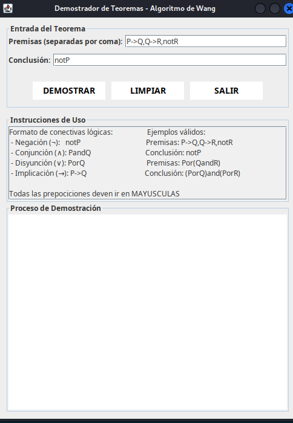
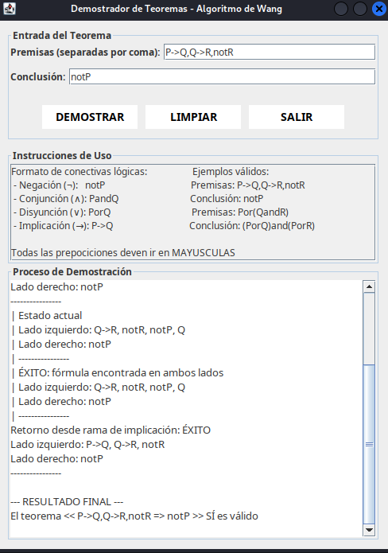

# Algoritmo de Wang — Demostrador de Teoremas v1

## Descripción

Implementación del **Algoritmo de Wang** para demostrar si un argumento lógico proposicional es una tautología. El programa aplica reglas del cálculo de secuentes hasta cerrar o refutar el árbol de prueba.

## ¿Qué es el Algoritmo de Wang?

El algoritmo de Wang (1960) es un procedimiento de decisión para la lógica proposicional clásica. Trabaja sobre **secuentes** de la forma `Γ ⊢ Δ`, donde Γ son las premisas y Δ la conclusión. Un secuente es válido si, siempre que todas las fórmulas de Γ sean verdaderas, al menos una de Δ también lo es.

## Reglas de inferencia

| Regla | Nombre | Descripción |
|-------|--------|-------------|
| **∧L** | Conjunción-izquierda | `A∧B, Γ ⊢ Δ` → `A, B, Γ ⊢ Δ` |
| **→L** | Implicación-izquierda | `A→B, Γ ⊢ Δ` → `¬A, B, Γ ⊢ Δ` |
| **→R** | Implicación-derecha | `Γ ⊢ A→B` → `A, Γ ⊢ B` |
| **¬L** | Negación-izquierda | `¬A, Γ ⊢ Δ` → `Γ ⊢ A, Δ` |
| **¬R** | Negación-derecha | `Γ ⊢ ¬A` → `A, Γ ⊢` |

## Capturas de pantalla

### Demostración paso a paso


### Teorema válido confirmado


## Cómo ejecutar

1. Abrir el proyecto en VSCode.
2. Ejecutar `src/AlgoritmoWangGUI_v1.java`.
3. Ingresar las premisas y la conclusión en el formato indicado.
4. Presionar **"Demostrar"** para iniciar el algoritmo.

## Estructura de archivos

```
Algoritmo_de_wong_logica_computacional_ vercion_1/
├── src/
│   └── AlgoritmoWangGUI_v1.java
├── bin/
├── Assets/
│   └── img/
│       ├── demostracion.png
│       └── teorema_valido.png
└── README.md
```

## Tecnologías

- Java 17+
- Swing (GUI)
