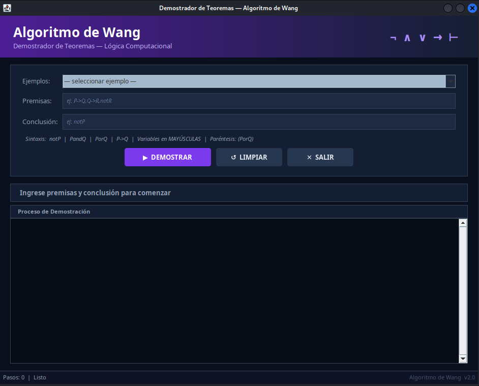
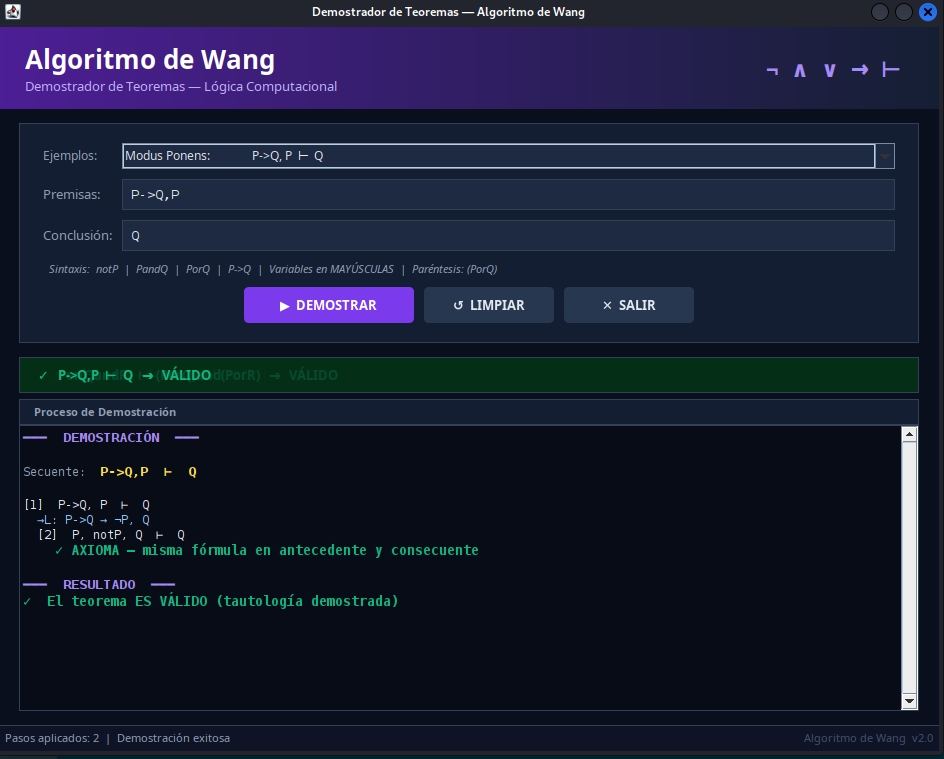
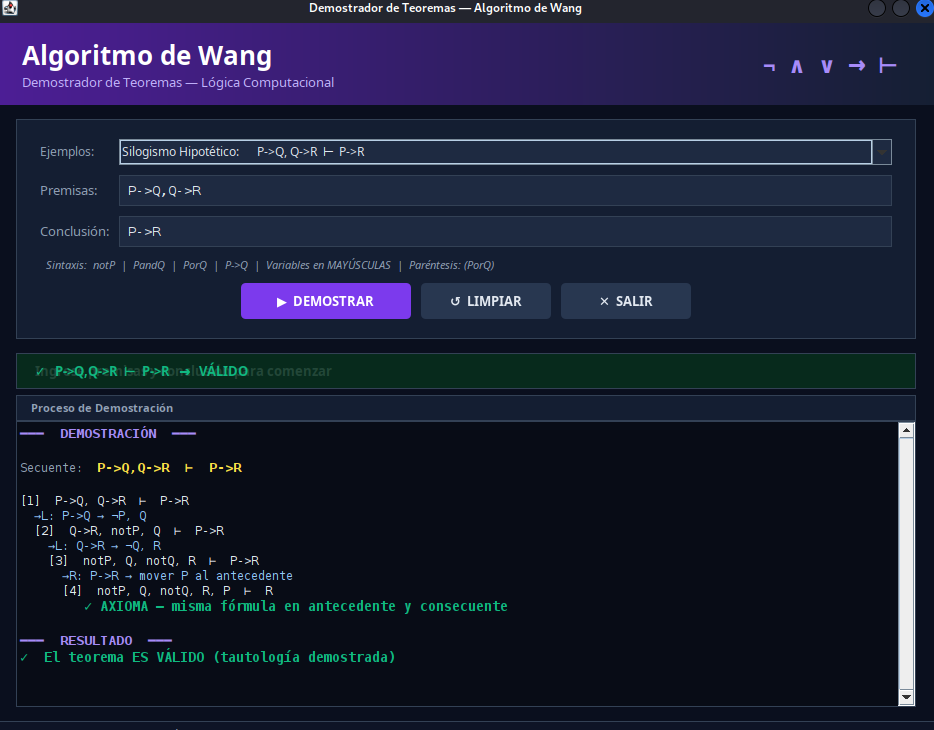
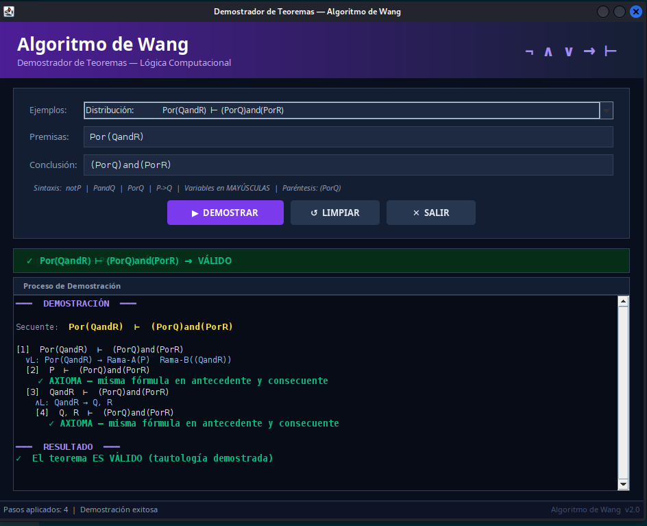

# Algoritmo de Wang — Demostrador de Teoremas

## Descripción general

Implementación del **Algoritmo de Wang** (cálculo de secuentes proposicionales) para demostrar automáticamente si un argumento lógico es una tautología. El programa recibe premisas y una conclusión, y aplica las reglas del cálculo de secuentes hasta cerrar o refutar el árbol de prueba.

---

## Conceptos teóricos

### ¿Qué es el Algoritmo de Wang?

El algoritmo de Wang (1960) es un procedimiento de decisión para la lógica proposicional clásica. Trabaja sobre **secuentes** de la forma:

```
Γ ⊢ Δ
```

donde **Γ** (antecedente) son las premisas y **Δ** (consecuente) es la conclusión. Un secuente es **válido** si, siempre que todas las fórmulas de Γ sean verdaderas, al menos una de Δ también lo es.

### Reglas de inferencia aplicadas

| Regla  | Nombre                | Descripción                                                  |
|--------|-----------------------|--------------------------------------------------------------|
| **∧L** | Conjunción-izquierda  | `A∧B, Γ ⊢ Δ` → `A, B, Γ ⊢ Δ`                             |
| **→L** | Implicación-izquierda | `A→B, Γ ⊢ Δ` → `¬A, B, Γ ⊢ Δ`                            |
| **→R** | Implicación-derecha   | `Γ ⊢ A→B` → `A, Γ ⊢ B`                                    |
| **¬L** | Negación-izquierda    | `¬A, Γ ⊢ Δ` → `Γ ⊢ A, Δ`                                  |
| **¬R** | Negación-derecha      | `Γ ⊢ ¬A` → `A, Γ ⊢`                                        |
| **¬¬L**| Doble negación        | `¬¬A, Γ ⊢ Δ` → `A, Γ ⊢ Δ`                                 |
| **∨L** | Disyunción-izquierda  | `A∨B, Γ ⊢ Δ` bifurca en `A,Γ⊢Δ` **y** `B,Γ⊢Δ`           |
| **∧R** | Conjunción-derecha    | `Γ ⊢ A∧B` bifurca en `Γ⊢A` **y** `Γ⊢B`                   |

### Axiomas — cierre de rama

Una rama se **cierra** (válida) cuando:
1. La misma fórmula aparece en antecedente y consecuente.
2. El consecuente contiene `A` y `¬A` (contradicción).

Una rama se **refuta** cuando quedan átomos sin coincidencia posible.

---

## Arquitectura del código

### Archivo único
`src/AlgoritmoWangGUI.java` — clase auto-contenida, sin dependencias externas.

### Mapa de la clase

```
AlgoritmoWangGUI  (JFrame)
│
├── construirUI()
│   ├── crearHeader()            — franja superior con gradiente violeta
│   ├── crearCentro()
│   │   ├── crearPanelEntrada()  — selector de ejemplos, campos, botones
│   │   └── crearPanelSalida()   — JTextPane con colores + banner resultado
│   └── crearStatusBar()         — contador de pasos y estado
│
├── procesarTeorema()            — controlador del botón DEMOSTRAR
│   └── llama a demostrar()
│
├── demostrar(izq, der, nivel)   — algoritmo recursivo principal
│   ├── Axioma 1: contradiccion()
│   ├── Axioma 2: coincide()
│   └── Reglas: ∧L → →L → →R → ¬¬L → ¬L → ¬R → ∨L → ∧R
│
├── appendS(texto, estilo)       — escribe al JTextPane con color
│
└── Utilidades lógicas
    ├── dividir(formula, op)     — separa por operador principal
    ├── opPrincipal(formula)     — detecta operador de mayor alcance
    ├── simplificar(formula)     — elimina paréntesis redundantes
    ├── contradiccion(der)       — detecta A y ¬A en consecuente
    └── coincide(izq, der)       — detecta fórmula en ambos lados
```

### Flujo de ejecución

```
[Usuario] ingresa premisas y conclusión
              ↓
        procesarTeorema()
              ↓
   split(",") → List<String> premisas
              ↓
   demostrar(premisas, conclusion, nivel=0)   ← recursivo
              ↓
     ¿Axioma?  →  true  (VÁLIDO  ✓)
     ¿Sin conectivas?  →  false  (INVÁLIDO ✗)
     ¿Regla aplicable?  →  llamada recursiva nivel+1
```

### Decisiones de implementación clave

- **`JTextPane` con `StyledDocument`** en lugar de `JTextArea` para mostrar cada regla y nodo del árbol con color diferente.
- **Análisis sintáctico manual** sin expresiones regulares: `dividir()` recorre la fórmula carácter a carácter manteniendo un contador de paréntesis para detectar el operador principal a nivel 0.
- **Simplificación de paréntesis**: `simplificar()` elimina de forma iterativa los paréntesis más externos que no alteran la estructura, evitando falsos negativos en la comparación de fórmulas.
- **Recursión con backtracking**: las reglas →L, ¬L y →R intentan una rama y regresan para probar otra si falla, usando el valor booleano de retorno.

---

## Sintaxis de entrada

| Conectiva    | Símbolo | Escribir     |
|--------------|---------|--------------|
| Negación     | ¬P      | `notP`       |
| Conjunción   | P ∧ Q   | `PandQ`      |
| Disyunción   | P ∨ Q   | `PorQ`       |
| Implicación  | P → Q   | `P->Q`       |
| Paréntesis   | (P ∨ Q) | `(PorQ)`     |

> Variables proposicionales en **MAYÚSCULAS** (P, Q, R, …).  
> Premisas separadas por coma sin espacios: `P->Q,Q->R,notR`

### Ejemplos incluidos en la interfaz

| Teorema               | Premisas          | Conclusión        |
|-----------------------|-------------------|-------------------|
| Modus Ponens          | `P->Q,P`          | `Q`               |
| Silogismo Hipotético  | `P->Q,Q->R`       | `P->R`            |
| Modus Tollens         | `P->Q,notQ`       | `notP`            |
| Doble Negación        | `notnotP`         | `P`               |
| Ley De Morgan ∧       | `not(PandQ)`      | `notPornotQ`      |
| Distribución          | `Por(QandR)`      | `(PorQ)and(PorR)` |
| Contrapositiva        | `P->Q`            | `notQ->notP`      |

---

## Interfaz gráfica — componentes

| Zona              | Descripción                                                        |
|-------------------|--------------------------------------------------------------------|
| **Header**        | Gradiente violeta → azul, título y decoración con símbolos Unicode |
| **Panel entrada** | Combo de ejemplos, campos de premisas y conclusión, 3 botones      |
| **Banner resultado** | Verde (VÁLIDO) / Rojo (NO VÁLIDO) con el secuente completo      |
| **Área de proceso** | `JTextPane` coloreado, muestra el árbol de prueba paso a paso   |
| **Barra estado**  | Número de pasos aplicados y resumen final                          |

### Código de colores del log

| Color       | Significado                    |
|-------------|--------------------------------|
| Amarillo    | Secuente inicial               |
| Azul claro  | Regla aplicada (∧L, →R, …)    |
| Blanco      | Nodo del árbol (Γ ⊢ Δ)        |
| Verde       | Axioma / rama cerrada          |
| Rojo        | Rama refutada                  |
| Violeta     | Encabezados de sección         |

---

## Compilar y ejecutar

```bash
cd Algoritmo_de_wong_logica_computacional/src
javac AlgoritmoWangGUI.java
java  AlgoritmoWangGUI
```

**Requisitos:** JDK 8 o superior. Solo usa `javax.swing` y `java.util` (librería estándar).

---

## Complejidad y limitaciones

- **Completitud:** el algoritmo es completo para la lógica proposicional; siempre termina.
- **Complejidad temporal:** exponencial en el peor caso (el problema SAT es NP-completo); aceptable para fórmulas pequeñas de curso.
- **No soporta:** lógica de predicados, cuantificadores, ni bicondicional `↔`.
- **Extensión sugerida:** añadir `P<->Q` como abreviatura de `(P->Q)and(Q->P)`.

---

## Capturas de pantalla

### Pantalla de inicio


### Modus Ponens


### Silogismo Hipotético


### Distribución


---

## Estructura de archivos

```
Algoritmo_de_wong_logica_computacional_ vercion_2/
├── src/
│   └── AlgoritmoWangGUI.java    ← archivo único auto-contenido
├── bin/
│   └── AlgoritmoWangGUI.class
├── Assets/
│   └── img/
│       ├── inicio.png
│       ├── modus_ponens.png
│       ├── silogismo_hipotetico.png
│       └── distribucion.png
└── README.md                    ← este archivo
```
