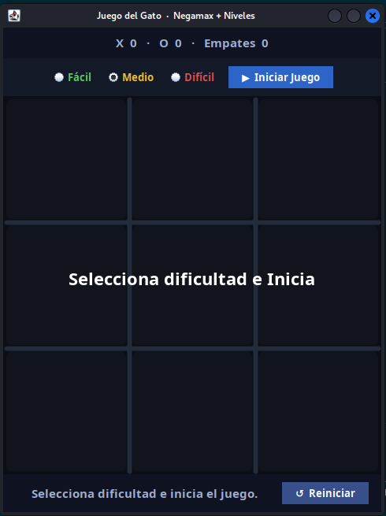
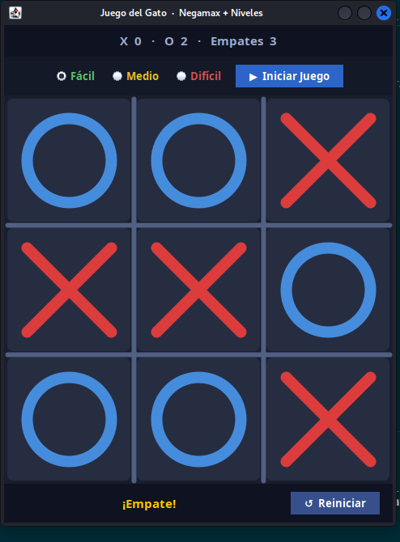
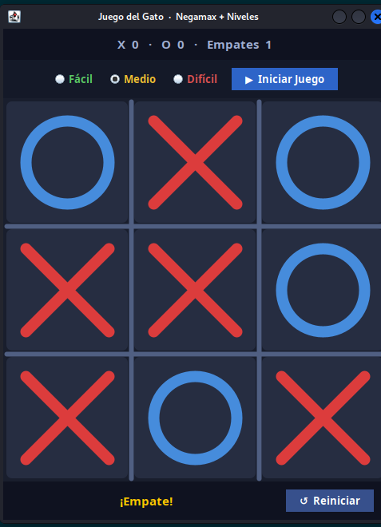

# Gato (Tic-Tac-Toe) con Negamax

## Descripción

Juego de **Gato (Tres en Raya)** con inteligencia artificial basada en el algoritmo **Negamax**. El jugador puede elegir entre tres niveles de dificultad: Fácil, Medio y Difícil.

## Algoritmo Negamax

**Negamax** es una variante simplificada de Minimax que aprovecha que en juegos de suma cero, el valor para un jugador es el negativo del valor para el oponente.

```
función negamax(estado, profundidad):
    si estado es terminal:
        retornar puntuación
    mejorPuntuación = -∞
    para cada movimiento disponible:
        aplicar movimiento
        puntuación = -negamax(nuevoEstado, profundidad - 1)
        mejorPuntuación = max(mejorPuntuación, puntuación)
        deshacer movimiento
    retornar mejorPuntuación
```

## Niveles de dificultad

| Nivel | Comportamiento |
|-------|----------------|
| **Fácil** | IA elige movimientos aleatorios |
| **Medio** | IA usa profundidad limitada |
| **Difícil** | IA usa Negamax completo (imbatible) |

## Capturas de pantalla

### Selección de dificultad


### Nivel fácil


### Nivel medio


### Nivel difícil


## Cómo ejecutar

1. Abrir el proyecto en VSCode.
2. Ejecutar `src/Gato_Grafico.java`.
3. Seleccionar nivel de dificultad.
4. Hacer clic en una celda para realizar tu movimiento.

## Estructura de archivos

```
JUEGO_Gato_ALGORITHM_NegamaX/
├── src/
│   ├── Clase_Gato.java       ← lógica del juego y Negamax
│   └── Gato_Grafico.java     ← interfaz gráfica (main)
├── bin/
├── Assets/
│   └── img/
│       ├── seleccion_dificultad.png
│       ├── ejecucion_nivel_facil.png
│       ├── ejecucion_nivel_medio.png
│       └── ejecucion_nivel_dificil.png
└── README.md
```

## Tecnologías

- Java 17+
- Swing (GUI)
