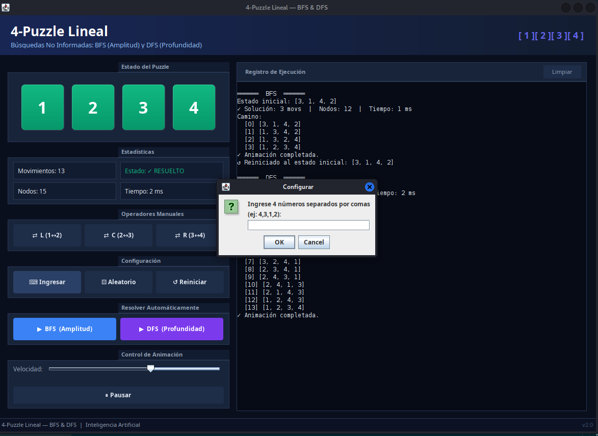
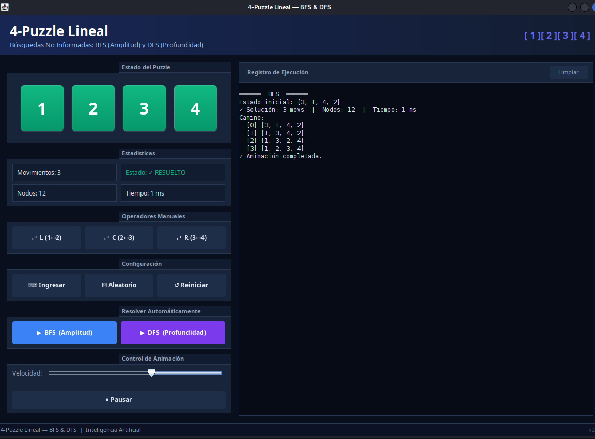
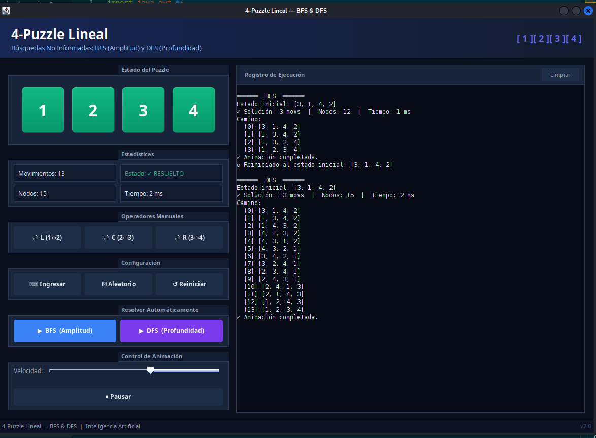

# 4-Puzzle Lineal — Búsquedas BFS y DFS

## Descripción general

Implementación del **4-Puzzle Lineal**, un problema clásico de búsqueda en IA. El estado es un arreglo de 4 elementos que deben quedar en orden ascendente `[1, 2, 3, 4]` aplicando únicamente tres operadores de intercambio. El programa resuelve el puzzle automáticamente usando **BFS** (Búsqueda por Amplitud) y **DFS** (Búsqueda por Profundidad), visualiza la solución con animación y permite jugar manualmente.

---

## El problema

### Estado

Un arreglo de 4 números enteros distintos, ej: `[3, 1, 4, 2]`.

### Estado meta

`[1, 2, 3, 4]` — cualquier ordenación estrictamente ascendente.

### Operadores (acciones)

| Operador     | Acción              | Posiciones afectadas |
|--------------|---------------------|----------------------|
| **Izquierdo**| Intercambia pos 1↔2 | índices 0 y 1        |
| **Central**  | Intercambia pos 2↔3 | índices 1 y 2        |
| **Derecho**  | Intercambia pos 3↔4 | índices 2 y 3        |

Cada operador genera un nuevo estado. El espacio de búsqueda es finito y pequeño (máximo 4! = 24 estados únicos con números del 1-4).

---

## Algoritmos implementados

### BFS — Búsqueda por Amplitud (Breadth-First Search)

Explora todos los nodos nivel por nivel usando una **cola FIFO**.

```
Propiedades:
  ✓ Completo:  siempre encuentra solución si existe
  ✓ Óptimo:    garantiza la ruta más corta (menos movimientos)
  ✗ Memoria:   almacena todos los nodos del nivel actual
```

**Pseudocódigo:**
```
cola ← [estadoInicial]
visitados ← {estadoInicial}
mientras cola no vacía:
    nodo ← cola.poll()
    si estaResuelto(nodo): retornar reconstruirCamino(nodo)
    para cada operador op en [0,1,2]:
        sig ← aplicarOp(nodo, op)
        si sig no visitado: cola.add(sig); visitados.add(sig)
retornar null
```

### DFS — Búsqueda por Profundidad (Depth-First Search)

Explora tan profundo como sea posible en cada rama usando una **pila LIFO**, con límite de profundidad.

```
Propiedades:
  ✓ Completo:  con límite de profundidad (evita ciclos infinitos)
  ✗ Óptimo:    NO garantiza la ruta más corta
  ✓ Memoria:   solo almacena el camino actual (mejor que BFS)
```

**Pseudocódigo:**
```
pila ← [estadoInicial]
visitados ← {estadoInicial}
mientras pila no vacía:
    nodo ← pila.pop()
    si estaResuelto(nodo): retornar reconstruirCamino(nodo)
    si nodo.profundidad < LIMITE:
        para op en [2,1,0]:   // inverso → explora izquierda primero
            sig ← aplicarOp(nodo, op)
            si sig no visitado: pila.push(sig); visitados.add(sig)
retornar null
```

### Reconstrucción del camino

Ambos algoritmos usan una clase interna `Nodo` que guarda referencia al nodo padre:

```java
class Nodo {
    int[] estado;
    Nodo  padre;
    int   profundidad;
}
```

Al llegar al estado meta, se sigue la cadena de padres hacia atrás para obtener la secuencia de estados desde el inicial hasta la solución.

---

## Arquitectura del código

### Archivo único
`src/PuzleLineal_CG.java` — auto-contenido, sin clases externas necesarias.

### Mapa de la clase

```
PuzleLineal_CG  (JFrame)
│
├── construirUI()
│   ├── crearHeader()           — franja azul oscuro con gradiente
│   ├── crearIzquierdo()        — columna fija 435 px
│   │   ├── panelTiles          — visualización del estado actual
│   │   ├── Stats (lblMov, etc.)
│   │   ├── Operadores manuales (L, C, R)
│   │   ├── Configuración (ingresar, aleatorio, reiniciar)
│   │   ├── Resolver (BFS, DFS)
│   │   └── Control animación (slider, pausa)
│   ├── crearDerecho()          — log de ejecución (JTextArea)
│   └── crearStatusBar()
│
├── Lógica del puzzle
│   ├── aplicarOp(estado, op)   — intercambia par según operador
│   ├── estaResuelto(estado)    — comprueba orden ascendente
│   ├── aplicarOp manual        — actualiza UI + log
│   ├── generarConfiguracion()  — input del usuario
│   └── generarAleatorio()      — shuffle de [1,2,3,4]
│
├── Algoritmos
│   ├── bfs(estadoInicial, nodosRef[])  — retorna LinkedList<int[]>
│   ├── dfs(estadoInicial, nodosRef[])  — retorna LinkedList<int[]>
│   └── reconstruir(Nodo)               — sigue cadena de padres
│
├── Animación
│   ├── iniciarAnimacion()      — Timer de Swing, delay = slider
│   └── toggleAnim()            — pausa / reanuda el Timer
│
└── Clase interna: Nodo {estado, padre, profundidad}
```

### Decisiones de implementación clave

- **`javax.swing.Timer`** en lugar de `Thread.sleep()` para la animación: el Timer dispara eventos en el Event Dispatch Thread, evitando bloqueos y condiciones de carrera.
- **`Set<String>` de visitados** con `Arrays.toString()` como clave: conversión simple y eficiente para arreglos pequeños de enteros.
- **Clase `Nodo` interna** con referencia al padre: permite reconstruir el camino en O(profundidad) siguiendo la cadena hacia atrás, sin necesidad de `Map<estado, padre>`.
- **`nodosRef[]` como parámetro de salida**: al ser un arreglo, permite devolver el contador de nodos explorados desde dentro del método de búsqueda (Java no tiene paso por referencia de primitivos).
- **Tiles con `paintComponent()` personalizado**: gradientes, bordes redondeados y color dinámico (azul → ámbar durante animación → verde al resolver) sin usar imágenes externas.
- **`estadoInicial` separado de `estadoActual`**: permite reiniciar el puzzle al punto de partida original incluso después de movimientos manuales o animaciones.

---

## Interfaz gráfica — componentes

| Zona              | Descripción                                                              |
|-------------------|--------------------------------------------------------------------------|
| **Header**        | Gradiente azul marino, título y representación `[1][2][3][4]`            |
| **Tiles**         | 4 paneles con `paintComponent()`: gradiente, borde redondeado, número grande |
| **Estadísticas**  | Movimientos, estado, nodos explorados, tiempo en ms                      |
| **Operadores**    | 3 botones manuales (L, C, R) para jugar manualmente                     |
| **Configuración** | Ingresar configuración personalizada, aleatoria, o reiniciar             |
| **Resolver**      | Botones BFS y DFS — resuelven y animan la solución                      |
| **Animación**     | Slider de velocidad (150ms – 2000ms), botón Pausar/Continuar             |
| **Log**           | `JTextArea` monoespaced con el registro de todas las operaciones         |

### Estados de color de los tiles

| Color      | Estado                                    |
|------------|-------------------------------------------|
| **Azul**   | Estado normal / manual                    |
| **Ámbar**  | Paso intermedio durante la animación      |
| **Verde**  | Estado resuelto `[1, 2, 3, 4]` alcanzado |

---

## Compilar y ejecutar

```bash
cd juego_4-PulzeJava/src
javac PuzleLineal_CG.java
java  PuzleLineal_CG
```

**Requisitos:** JDK 8 o superior. Solo usa `javax.swing`, `java.awt` y `java.util`.

> **Nota:** los archivos `PuzleLineal_SG_BFS.java`, `PuzleLineal_SG_DFS.java`, `Nodo_BFS.java`, `ColasGLL.java` y `PilasGLL.java` fueron reemplazados por la versión v2.0 auto-contenida. Ya no son necesarios para compilar ni ejecutar.

---

## Comparación BFS vs DFS en este problema

| Métrica               | BFS            | DFS (límite 24) |
|-----------------------|----------------|-----------------|
| Solución óptima       | Siempre        | No garantizada  |
| Nodos explorados      | Más (por nivel)| Menos (en ramas)|
| Tiempo típico         | ~1 ms          | < 1 ms          |
| Memoria               | Mayor          | Menor           |
| Profundidad máxima    | Sin límite*    | 24 pasos        |

*BFS termina en el primer nivel donde existe solución.

---

## Capturas de pantalla

### Pantalla de inicio


### Ingresar vector inicial


### Solución con BFS


### Solución con DFS


---

## Estructura de archivos

```
Juego_Game_4-PulzeJava/
├── src/
│   ├── PuzleLineal_CG.java        ← archivo principal v2.0 (auto-contenido)
│   ├── PuzleLineal_SG_BFS.java    ← versión anterior (obsoleta)
│   ├── PuzleLineal_SG_DFS.java    ← versión anterior (obsoleta)
│   ├── Nodo_BFS.java              ← versión anterior (obsoleta)
│   ├── Nodo_DFS.java              ← versión anterior (obsoleta)
│   ├── ColasGLL.java              ← versión anterior (obsoleta)
│   └── PilasGLL.java              ← versión anterior (obsoleta)
├── bin/
│   └── PuzleLineal_CG.class
├── Assets/
│   └── img/
│       ├── inicio.png
│       ├── ingresar_vector.png
│       ├── solucion_BFS.png
│       └── solucion_dfs.png
└── README.md                      ← este archivo
```
