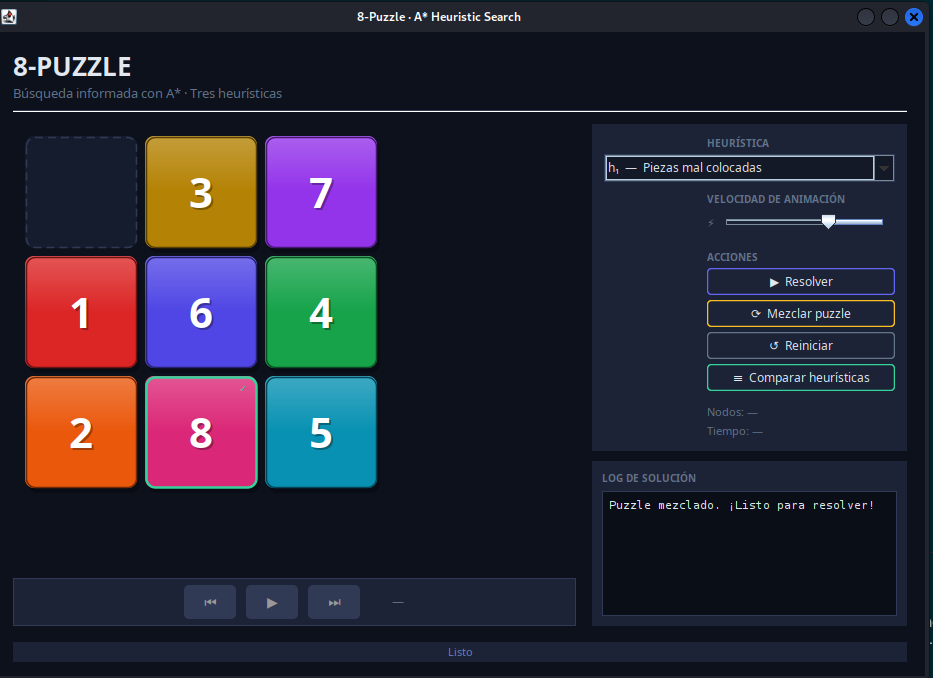
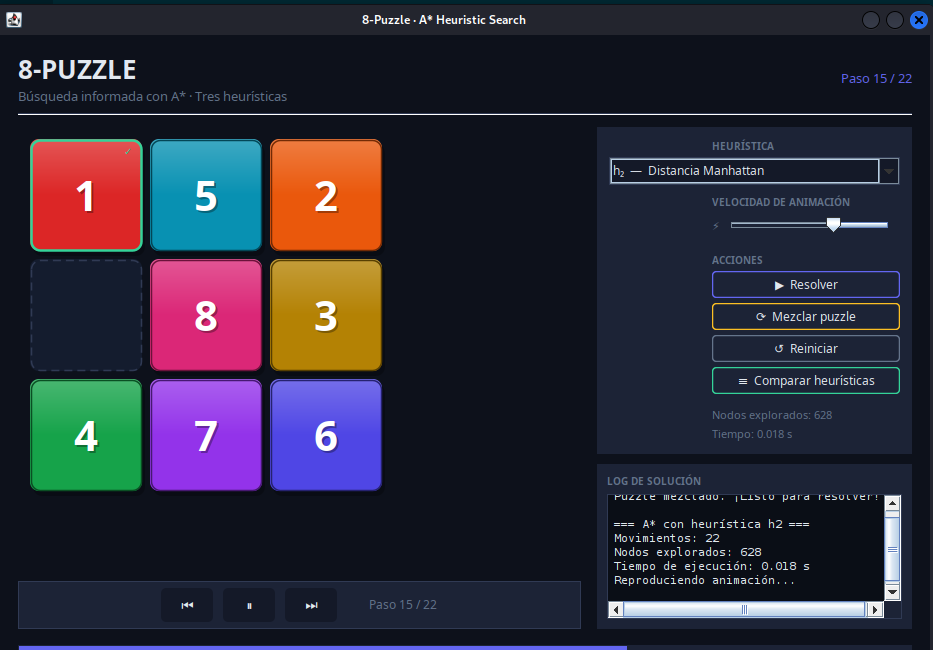
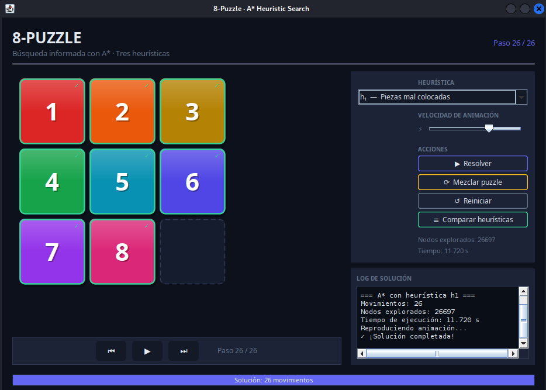

# 8-Puzzle Interactivo con Heurísticas

## Descripción

Implementación interactiva del clásico **8-Puzzle** con resolución automática basada en búsqueda heurística. El jugador puede mezclar el puzzle manualmente y dejar que el algoritmo lo resuelva usando dos heurísticas distintas.

## El problema

El 8-Puzzle consiste en un tablero de 3×3 con 8 fichas numeradas y un espacio vacío. El objetivo es alcanzar el estado meta deslizando fichas al espacio vacío.

## Heurísticas implementadas

### 1. Distancia Manhattan
Suma de las distancias horizontal + vertical de cada ficha hasta su posición meta.

```
h(n) = Σ |fila_actual - fila_meta| + |col_actual - col_meta|
```

### 2. Piezas mal colocadas
Cuenta cuántas fichas no están en su posición correcta.

```
h(n) = número de fichas fuera de su lugar
```

La **Distancia Manhattan** es más informada y genera soluciones más eficientes.

## Capturas de pantalla

### Inicio y mezcla del puzzle


### Solución con distancia Manhattan


### Solución con piezas mal colocadas


## Cómo ejecutar

1. Abrir el proyecto en VSCode.
2. Ejecutar `src/PuzzleGUI.java`.
3. Presionar **"Mezclar"** para desordenar el puzzle.
4. Seleccionar heurística y presionar **"Resolver"**.

## Estructura de archivos

```
Juego_Game_8Puzle_Interactive/
├── src/
│   ├── PuzzleGUI.java                  ← interfaz gráfica (main)
│   ├── Ocho_Puzle_Heuristica.java      ← algoritmo heurístico
│   ├── ColasGLL.java                   ← estructura de cola
│   └── Nodo_BFS.java                   ← nodo de búsqueda
├── bin/
├── Assets/
│   └── img/
│       ├── inicio_mezclar_puzzle.png
│       ├── ejecucion_manhatan.png
│       └── solucion_piezas_mal_colocadas.png
└── README.md
```

## Tecnologías

- Java 17+
- Swing (GUI)
