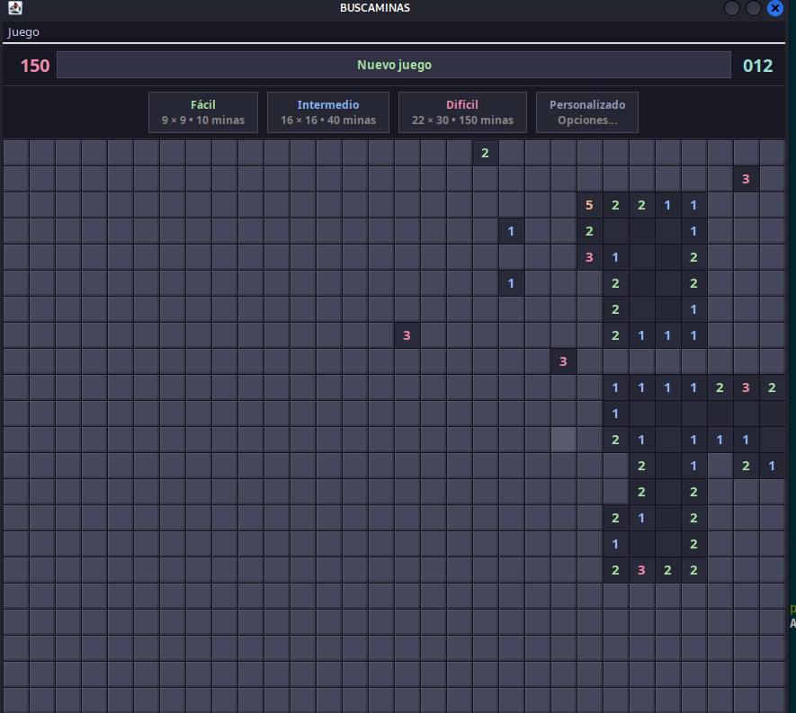
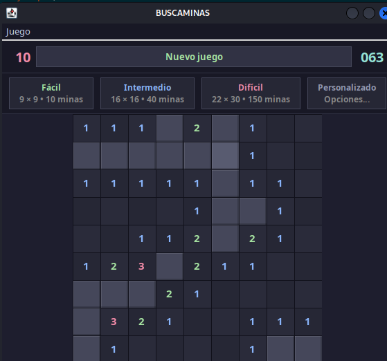
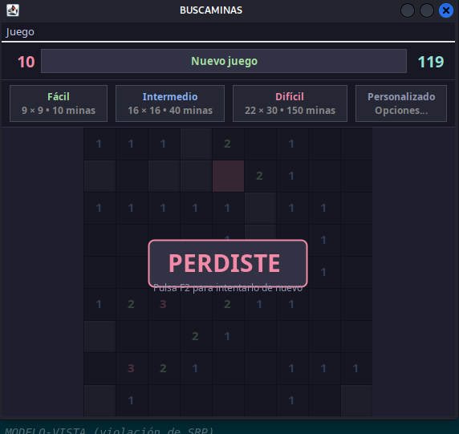

# Buscaminas con Backtracking

## Descripción

Implementación del clásico juego **Buscaminas** con un algoritmo de **Backtracking** para la colocación de minas y la resolución del tablero. Incluye múltiples niveles de dificultad, contador de minas y temporizador.

## Algoritmo de Backtracking

La expansión de celdas vacías usa un **flood-fill iterativo** (basado en pila, no recursivo) para evitar `StackOverflowError` en tableros grandes.

```
expandir(celda):
    pila ← [celda]
    mientras pila no vacía:
        actual ← pila.pop()
        revelar(actual)
        si actual tiene 0 minas vecinas:
            para cada vecino no revelado:
                pila.push(vecino)
```

## Niveles de dificultad

| Nivel | Tablero | Minas |
|-------|---------|-------|
| Fácil | 9×9 | 10 |
| Intermedio | 16×16 | 40 |
| Difícil | 16×30 | 99 |

## Capturas de pantalla

### Nivel intermedio


### Nivel difícil


### Solución 10×10


### Pantalla de derrota


## Cómo ejecutar

1. Abrir el proyecto en VSCode.
2. Ejecutar `src/Buscaminas_BackTrack.java`.
3. Seleccionar dificultad en el menú.
4. Clic para revelar celdas, clic derecho para marcar minas.

## Estructura de archivos

```
Juego_Game_Buscaminas/
├── src/
│   ├── Buscaminas_BackTrack.java   ← lógica principal y GUI (main)
│   └── Opciones.java               ← configuración de dificultades
├── bin/
├── Assets/
│   └── img/
│       ├── intermedio.png
│       ├── dificil.png
│       ├── 10x10solucion.png
│       └── perdiste.png
└── README.md
```

## Tecnologías

- Java 17+
- Swing (GUI)
