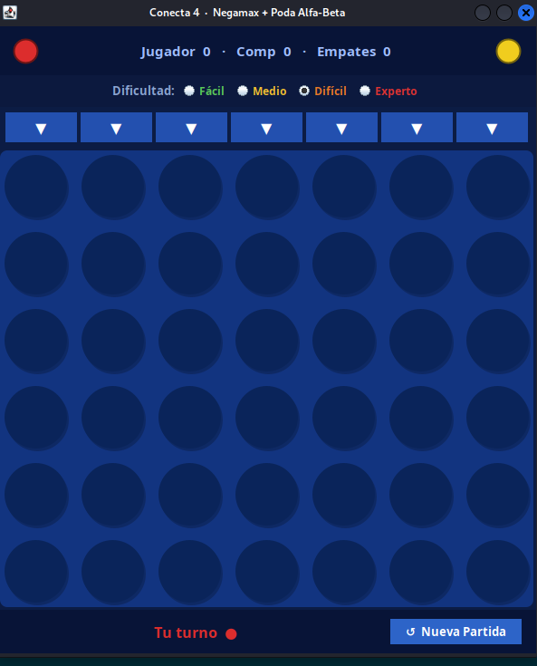
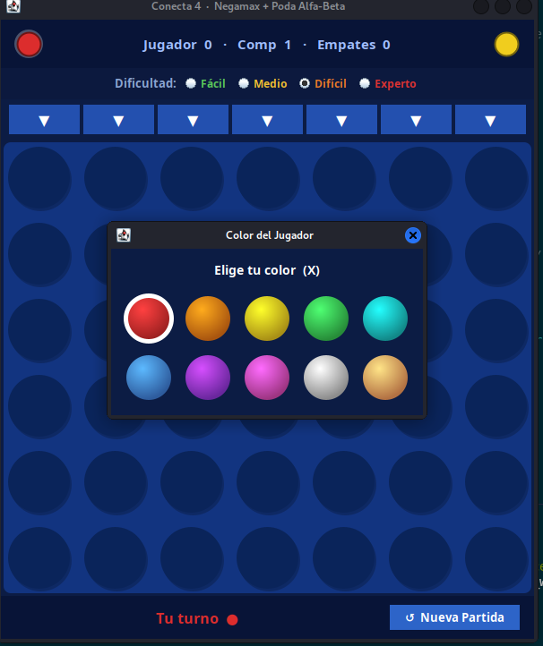
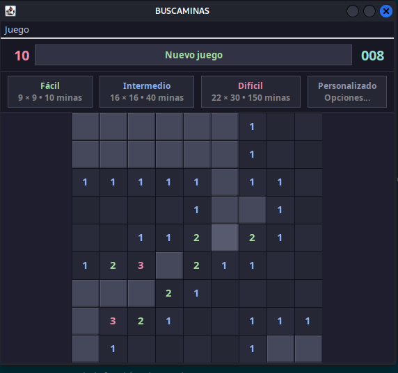
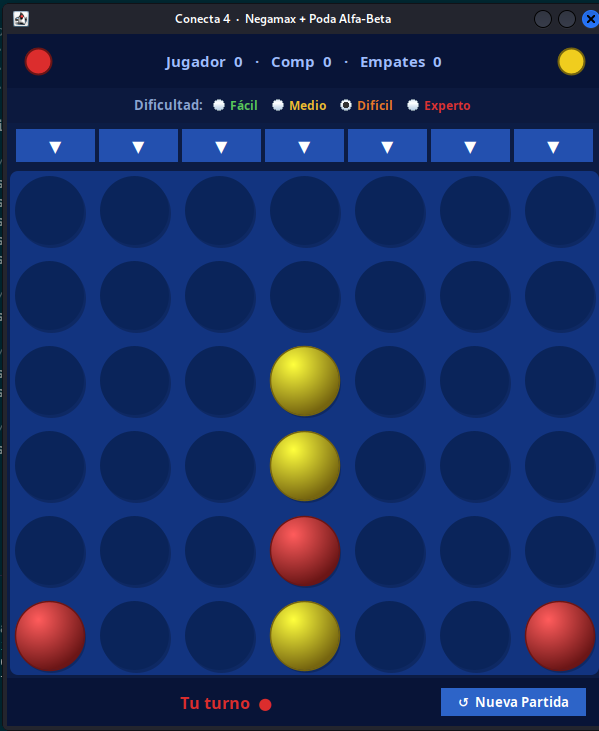
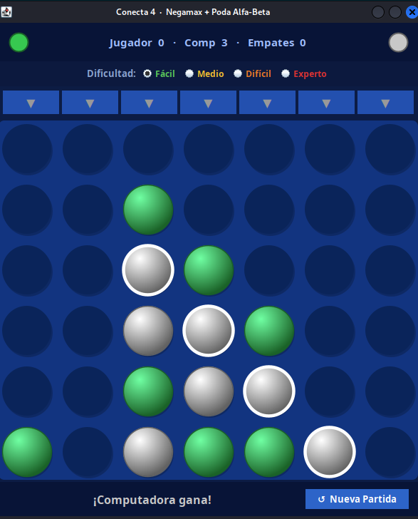
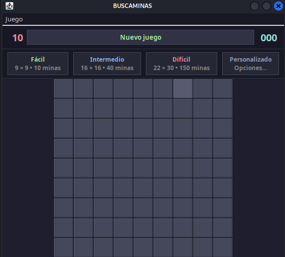

# Conecta 4 con Negamax

## Descripción

Implementación del juego **Conecta 4** con inteligencia artificial basada en el algoritmo **Negamax**. El jugador compite contra la IA eligiendo dificultad y color de ficha.

## Algoritmo Negamax

**Negamax** evalúa recursivamente todos los estados del juego hasta una profundidad determinada, eligiendo el movimiento que maximiza la puntuación propia minimizando la del oponente.

```
función negamax(tablero, profundidad, jugador):
    si profundidad == 0 o tablero terminal:
        retornar evaluar(tablero)
    mejorPuntuación = -∞
    para cada columna disponible:
        colocar ficha
        puntuación = -negamax(tablero, profundidad-1, oponente)
        mejorPuntuación = max(mejorPuntuación, puntuación)
        retirar ficha
    retornar mejorPuntuación
```

## Reglas del juego

- Tablero de 6 filas × 7 columnas (configurable).
- Gana el primero en alinear **4 fichas** en horizontal, vertical o diagonal.

## Capturas de pantalla

### Inicio del juego


### Elegir color


### Nivel fácil


### Turno del jugador rojo


### Victoria blanca


### Victoria amarilla


### Tablero 10×10


## Cómo ejecutar

1. Abrir el proyecto en VSCode.
2. Ejecutar `src/Conecta4_Negamax.java`.
3. Elegir color y dificultad.
4. Clic en la columna para colocar tu ficha.

## Estructura de archivos

```
Juego_Game_Conecta4/
├── src/
│   └── Conecta4_Negamax.java   ← lógica completa y GUI (main)
├── bin/
├── Assets/
│   └── img/
│       ├── inicio_juego.png
│       ├── elije_color.png
│       ├── facil.png
│       ├── turno_rojo.png
│       ├── gana_blanco.png
│       ├── gana_amarillo.png
│       └── 10x10_inicio_juego.png
└── README.md
```

## Tecnologías

- Java 17+
- Swing (GUI)
