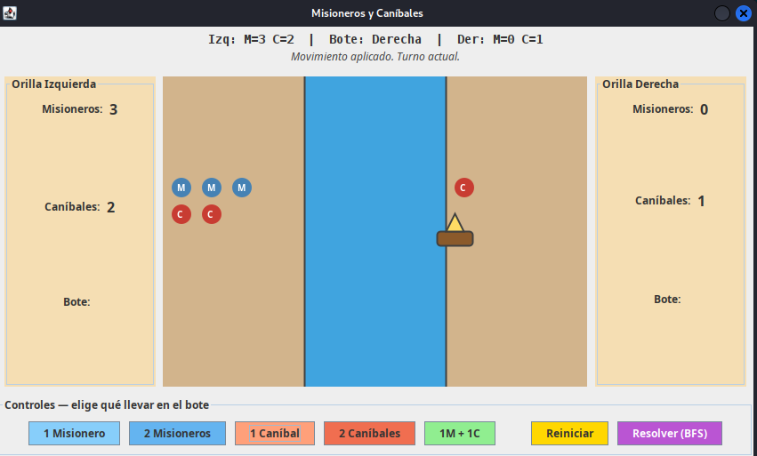
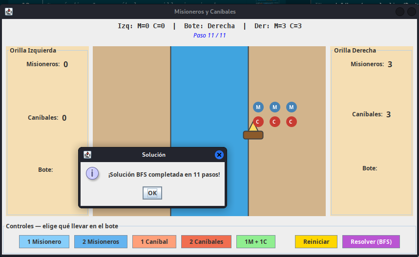

# Misioneros y Caníbales — BFS, DFS y DFS Recursivo

## Descripción

Implementación del clásico problema de **Misioneros y Caníbales** con interfaz gráfica interactiva y tres algoritmos de búsqueda: BFS, DFS con pila y DFS recursivo. Incluye animación paso a paso de la solución.

## El problema

Tres misioneros y tres caníbales deben cruzar un río usando un bote con capacidad para 2 personas. En ningún momento los caníbales pueden superar en número a los misioneros en ninguna orilla.

- **Estado:** `[mIzq, cIzq, bote, mDer, cDer]`
- **Estado inicial:** `[3, 3, 0, 0, 0]`
- **Estado meta:** `[0, 0, 1, 3, 3]`

## Algoritmos implementados

| Algoritmo | Estructura | Solución |
|-----------|------------|----------|
| **BFS** | Cola FIFO | Óptima (11 pasos) |
| **DFS con pila** | Pila LIFO | No óptima |
| **DFS recursivo** | Recursión | No óptima |

## Capturas de pantalla

### Estado inicial


### Un caníbal cruzando


### 1 Misionero + 1 Caníbal cruzando


### Solución completa


## Cómo ejecutar

### Interfaz gráfica (recomendado)
1. Abrir el proyecto en VSCode.
2. Ejecutar `src/InterfazCyM.java`.
3. Usar los botones para mover personas manualmente.
4. Presionar **"Resolver (BFS)"** para la solución automática animada.

### Consola (3 algoritmos comparados)
1. Ejecutar `src/Main.java`.
2. Ver la solución de los 3 algoritmos con tiempos de ejecución.

## Estructura de archivos

```
Juego_Game_Misioneros_y_Canibsales/
├── src/
│   ├── InterfazCyM.java          ← GUI interactiva (main GUI)
│   ├── Main.java                 ← comparación consola (main consola)
│   ├── CyM_SG_BFS.java           ← algoritmo BFS
│   ├── CyM_SG_DFS.java           ← algoritmo DFS con pila
│   ├── CyM_SG_DFS_Recursivo.java ← algoritmo DFS recursivo
│   ├── ColasGLL.java             ← estructura de cola
│   ├── PilasGLL.java             ← estructura de pila
│   ├── Nodo_BFS.java             ← nodo BFS
│   └── Nodo_DFS.java             ← nodo DFS
├── bin/
├── Assets/
│   └── img/
│       ├── inicio.png
│       ├── 1canibal.png
│       ├── 1canibal-1misionero.png
│       └── solucion.png
└── README.md
```

## Tecnologías

- Java 17+
- Swing (GUI)
