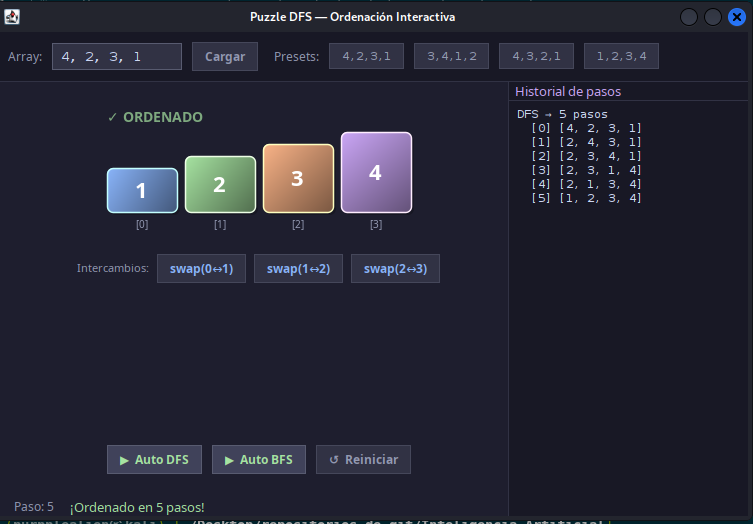
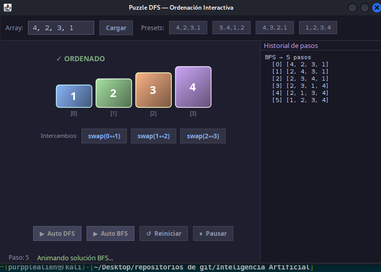

# Puzzle con DFS Recursivo

## Descripción

Visualizador de puzzle resuelto con **DFS Recursivo** y **BFS**. Permite comparar visualmente cómo ambos algoritmos encuentran soluciones para el puzzle, mostrando los pasos de forma animada.

## Algoritmos implementados

### DFS Recursivo (Depth-First Search)
Explora recursivamente los nodos más profundos primero, retrocediendo cuando no encuentra solución.

```
función DFS_Recursivo(estado, visitados):
    si esSolucion(estado): retornar estado
    para cada hijo de estado:
        si hijo no está en visitados:
            visitados.agregar(hijo)
            resultado = DFS_Recursivo(hijo, visitados)
            si resultado != null: retornar resultado
    retornar null
```

### BFS (Breadth-First Search)
Explora nivel por nivel garantizando la solución óptima.

## Capturas de pantalla

### Estado inicial


### Solución automática DFS


### Solución automática BFS


## Cómo ejecutar

1. Abrir el proyecto en VSCode.
2. Ejecutar `src/Main.java`.
3. Presionar **"Auto DFS"** o **"Auto BFS"** para ver la solución animada.

## Estructura de archivos

```
Juego_Game_PuzzleDFS_Recursivo/
├── src/
│   ├── Main.java                 ← GUI principal (main)
│   ├── PuzzleDFSRecursivo.java   ← lógica DFS recursivo
│   └── Nodo_DFS.java             ← nodo de búsqueda
├── bin/
├── Assets/
│   └── img/
│       ├── inicio.png
│       ├── autoDFS.png
│       └── autoBFS.png
└── README.md
```

## Tecnologías

- Java 17+
- Swing (GUI)
