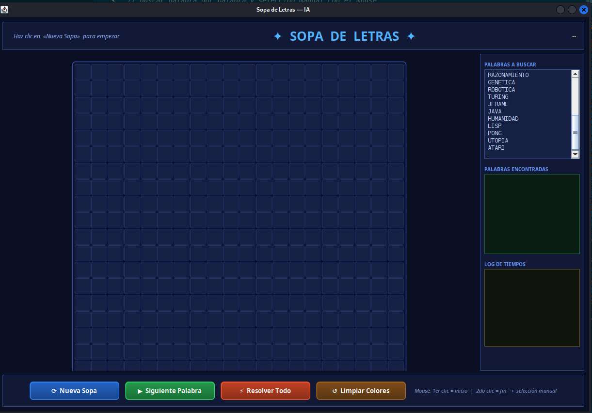
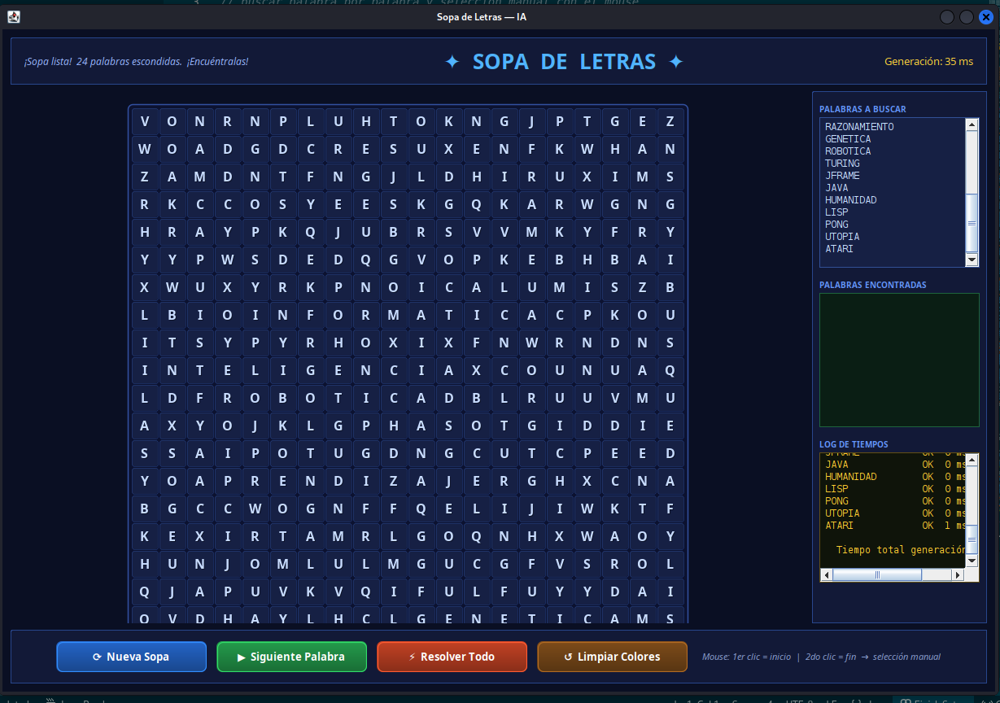
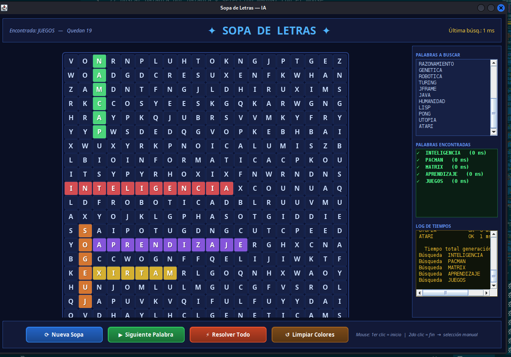
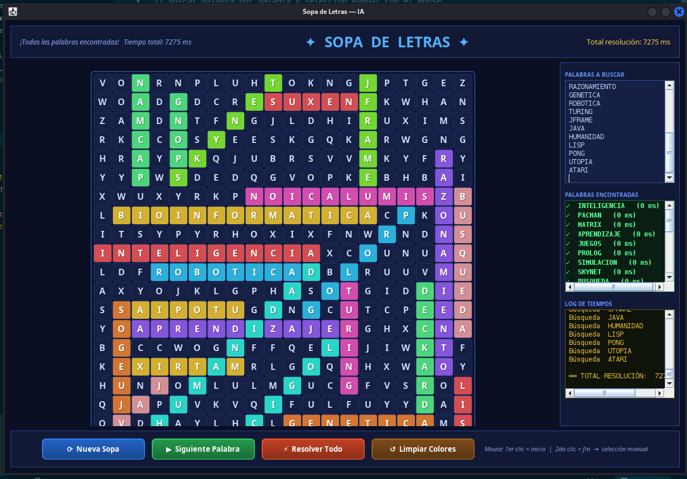
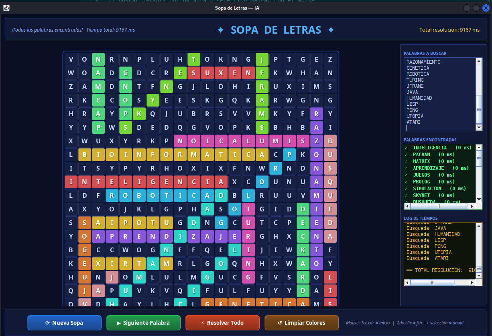

# Sopa de Letras

## Descripción

Juego de **Sopa de Letras** con interfaz dark theme y resolución automática. Las palabras se cargan desde un archivo de texto, incluye temporizador por palabra y animación de resolución completa.

## Funcionalidades

- Carga de palabras desde `palabras.txt`
- Resolución automática con resaltado de palabras encontradas
- Temporizador por cada palabra
- Botón **"Resolver Todo"** para completar todas las palabras con animación
- Generación de nuevas sopas
- Interfaz dark theme

## Algoritmo de búsqueda

El solver busca cada palabra en las 8 direcciones posibles:

```
direcciones = [↑, ↓, ←, →, ↖, ↗, ↙, ↘]

para cada palabra en listaPalabras:
    para cada celda (fila, col) en tablero:
        para cada dirección en direcciones:
            si coincide(palabra, fila, col, dirección):
                resaltar(palabra, fila, col, dirección)
```

## Capturas de pantalla

### Pantalla de inicio


### Nueva sopa generada


### Siguiente palabra


### Resolver todo


### Sopa completa


## Cómo ejecutar

1. Abrir el proyecto en VSCode.
2. Ejecutar `src/App.java`.
3. Hacer clic en las letras para seleccionar palabras.
4. Presionar **"Resolver Todo"** para la solución automática.

## Estructura de archivos

```
Juego_Game_Sopa de letras java/
├── src/
│   ├── App.java          ← lógica completa y GUI (main)
│   └── palabras.txt      ← lista de palabras a buscar
├── bin/
├── Assets/
│   └── img/
│       ├── inicio_sopa.png
│       ├── Nueva_sopa.png
│       ├── siguiente_palabra.png
│       ├── resolver_todo.png
│       └── sopa_completa.png
└── README.md
```

## Tecnologías

- Java 17+
- Swing (GUI)
