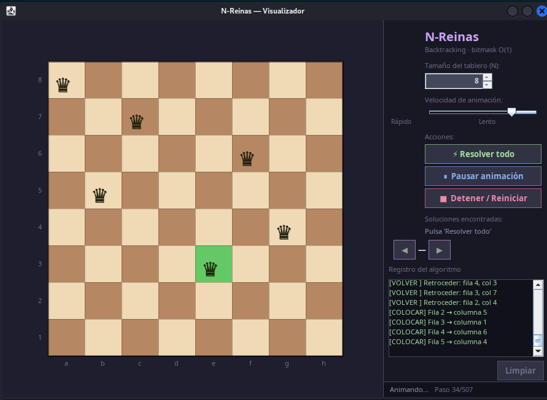
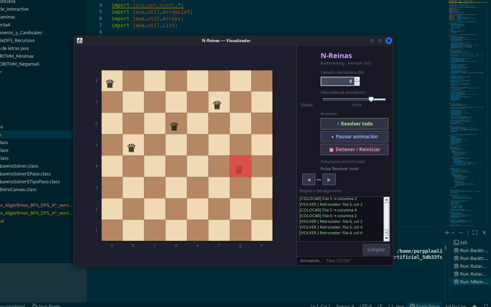
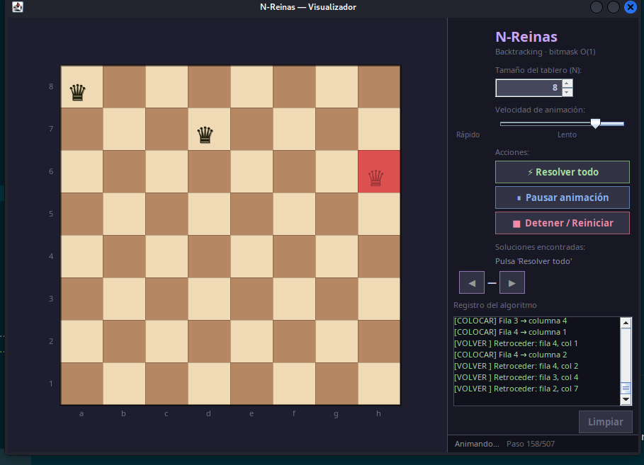
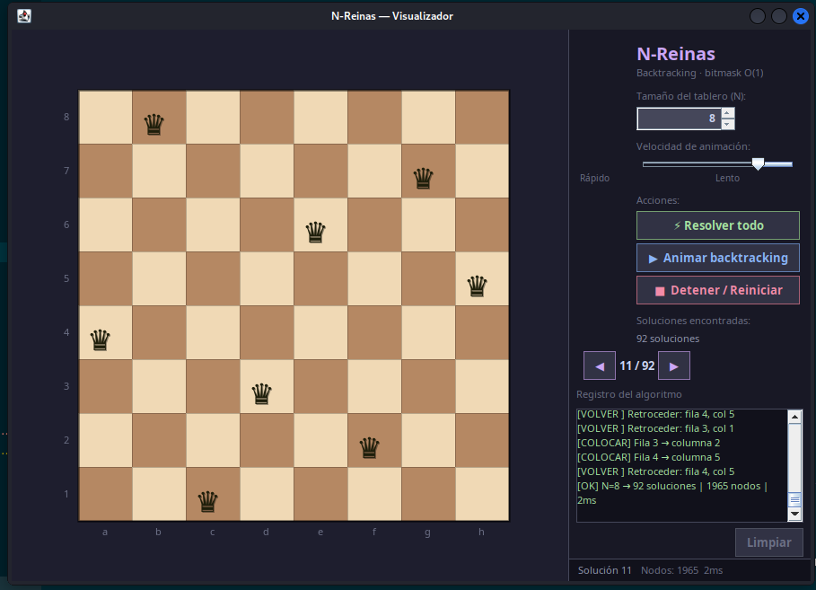
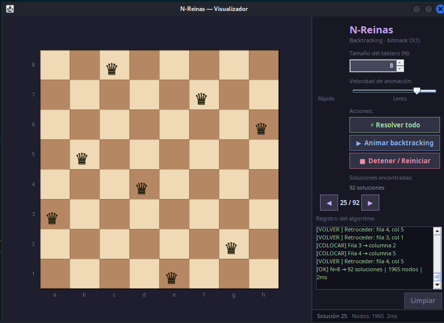
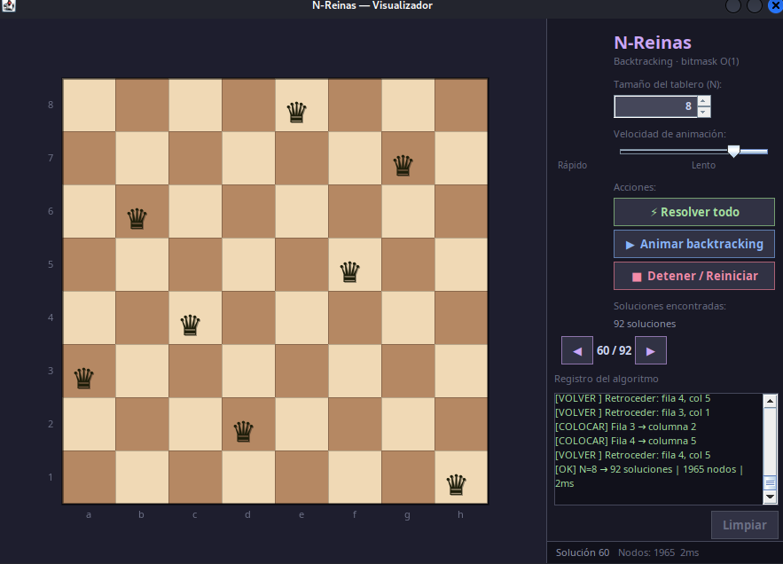
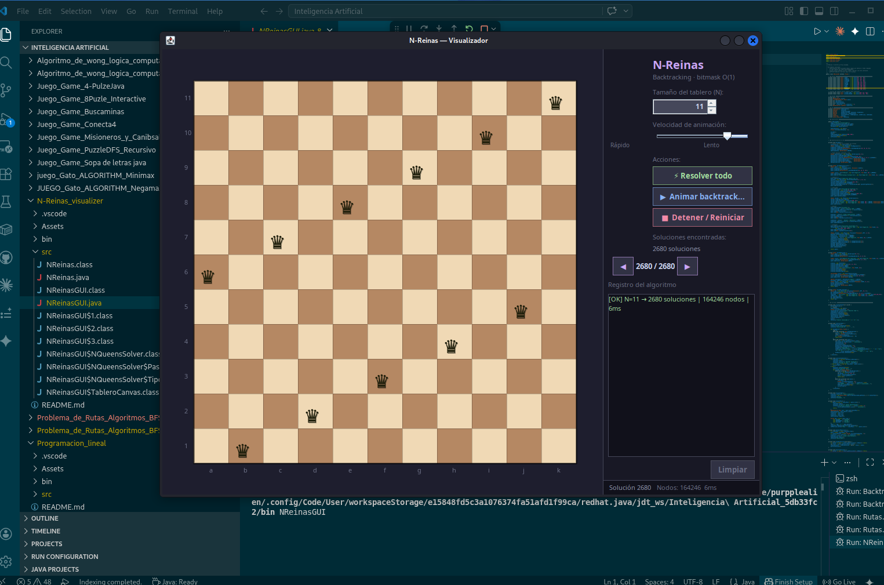
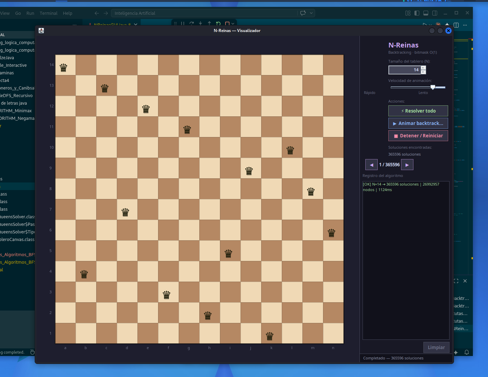

# N-Reinas — Visualizador con Backtracking

## Descripción

Visualizador interactivo del problema de las **N-Reinas** resuelto con **Backtracking**. Muestra paso a paso cómo el algoritmo coloca y retira reinas en el tablero hasta encontrar todas las soluciones válidas.

## El problema

Colocar N reinas en un tablero de N×N sin que ninguna se ataque entre sí (ninguna comparte fila, columna ni diagonal).

## Algoritmo de Backtracking

```
función colocarReina(fila):
    si fila == N: registrar solución
    para cada columna en 0..N-1:
        si esSeguro(fila, columna):
            tablero[fila][columna] = REINA
            colocarReina(fila + 1)
            tablero[fila][columna] = VACÍO   ← backtrack
```

El visualizador muestra en tiempo real cada colocación y retroceso del algoritmo.

## Capturas de pantalla

### Ejecución paso 1


### Ejecución paso 2


### Ejecución paso 3


### Tablero 8×8 — Solución 11


### Tablero 8×8 — Solución 25


### Tablero 8×8 — Solución 62


### Tablero 11×11 — Solución 2680


### Tablero 14×14 — Solución única


## Número de soluciones por tablero

| N | Soluciones |
|---|------------|
| 4 | 2 |
| 5 | 10 |
| 6 | 4 |
| 7 | 40 |
| 8 | 92 |
| 11 | 2,680 |
| 14 | 365,596 |

## Cómo ejecutar

1. Abrir el proyecto en VSCode.
2. Ejecutar `src/NReinasGUI.java`.
3. Seleccionar el tamaño del tablero (N).
4. Presionar **"Resolver"** para iniciar la visualización.

## Estructura de archivos

```
N-Reinas_visualizer/
├── src/
│   ├── NReinasGUI.java   ← interfaz gráfica (main)
│   └── NReinas.java      ← algoritmo de backtracking
├── bin/
├── Assets/
│   └── img/
│       ├── ejecucion_1.png
│       ├── ejecucion_2.png
│       ├── ejecucion_3.png
│       ├── 8x8_solucion_11.png
│       ├── 8x8_solucion_25.png
│       ├── 8x8_solucion_62.png
│       ├── tablero_11x11_solucion_2680.png
│       └── tablero_14x14_solucion_unica.png
└── README.md
```

## Tecnologías

- Java 17+
- Swing (GUI)
