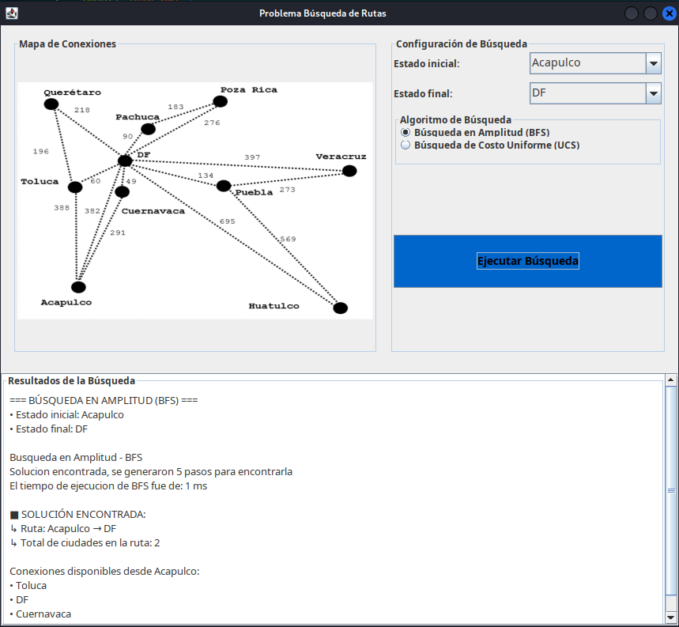
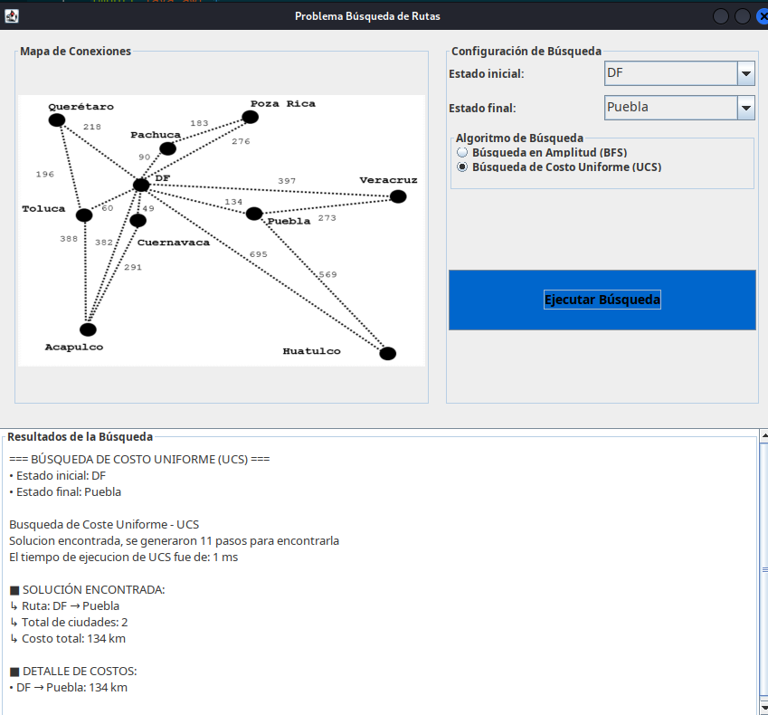

# Problema de Rutas — BFS y UCS (v1)

## Descripción

Visualizador de **planificación de rutas** en un mapa de ciudades mexicanas usando los algoritmos **BFS** (Búsqueda por Amplitud) y **UCS** (Búsqueda de Costo Uniforme).

## Ciudades del grafo

El grafo incluye ciudades como: Acapulco, Ciudad de México, Puebla, Veracruz, Oaxaca, Poza Rica, Huatulco, Querétaro, Pachuca, entre otras.

## Algoritmos implementados

### BFS (Breadth-First Search)
Explora nivel por nivel. Garantiza la ruta con **menos saltos**, pero no necesariamente la de menor costo.

```
Propiedades:
  ✓ Completo: siempre encuentra solución
  ✓ Óptimo en nodos: mínimo número de ciudades intermedias
  ✗ No considera costos de distancia
```

### UCS (Uniform Cost Search)
Expande siempre el nodo de menor costo acumulado. Garantiza la ruta de **menor distancia total**.

```
Propiedades:
  ✓ Completo: siempre encuentra solución
  ✓ Óptimo en costo: minimiza la distancia total
  ✗ Sin heurística (explora más nodos que A*)
```

## Capturas de pantalla

### BFS: Acapulco → Ciudad de México


### UCS: Ciudad de México → Puebla


## Cómo ejecutar

1. Abrir el proyecto en VSCode.
2. Ejecutar `src/Rutas_CG_UCS_BFS.java`.
3. Seleccionar ciudad origen y destino.
4. Elegir algoritmo (BFS o UCS) y presionar **"Buscar"**.

## Estructura de archivos

```
Problema_de_Rutas_Algoritmos_BFS_UCS_A*_vercion_1/
├── src/
│   ├── Rutas_CG_UCS_BFS.java      ← GUI principal (main)
│   ├── Rutas_SG_BFS.java          ← implementación BFS
│   ├── Rutas_SG_UCS.java          ← implementación UCS
│   ├── ColasGLL.java              ← cola FIFO
│   ├── ColasGLL_Ordenada.java     ← cola ordenada por costo
│   ├── Nodo_BFS.java              ← nodo de búsqueda
│   └── G1.png                     ← imagen del grafo de ciudades
├── bin/
├── Assets/
│   └── img/
│       ├── BFS_Acapulco_DF.png
│       └── UCS_DF_Puebla.png
└── README.md
```

## Tecnologías

- Java 17+
- Swing (GUI)
