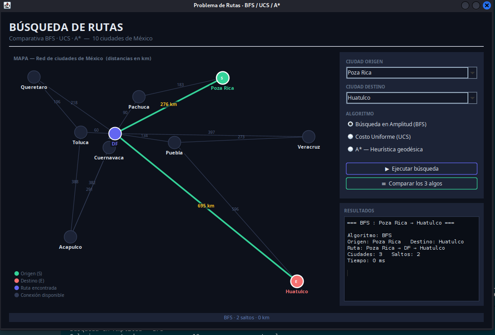
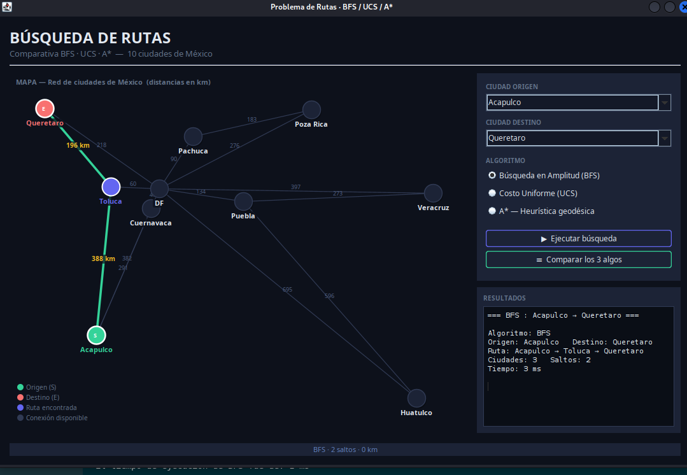
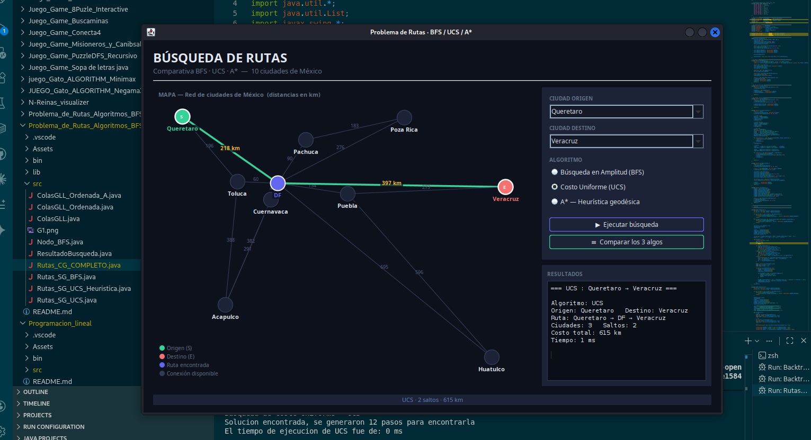
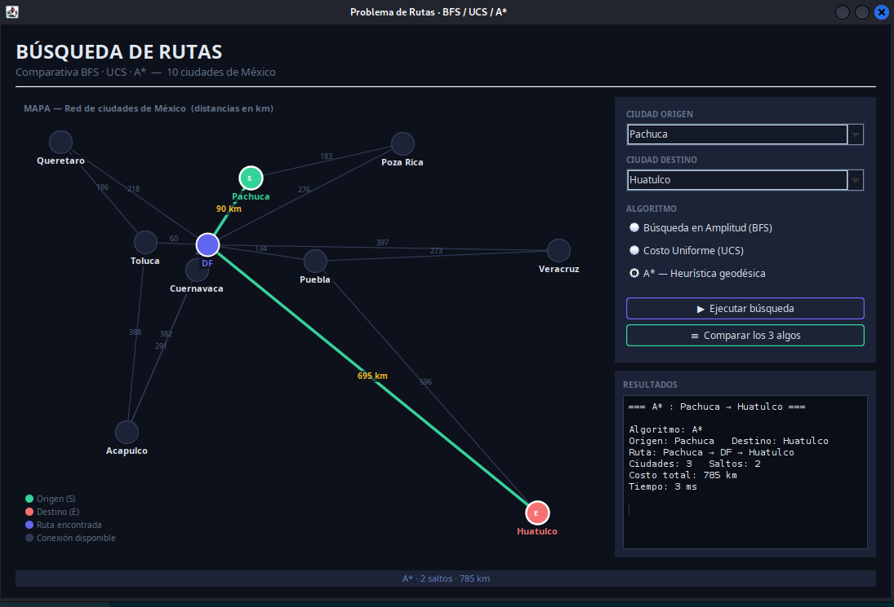

# Problema de Rutas — BFS, UCS y A* (v2)

## Descripción

Versión extendida del planificador de rutas que agrega el algoritmo **A\*** (A-Star) con soporte de heurísticas. Implementa **BFS**, **UCS** y **A\*** sobre un mapa de ciudades mexicanas.

## Ciudades del grafo

Grafo de ciudades mexicanas: Acapulco, Ciudad de México, Puebla, Veracruz, Poza Rica, Huatulco, Querétaro, Pachuca, Oaxaca, entre otras.

## Algoritmos implementados

### BFS — Búsqueda por Amplitud
Mínimo número de saltos, sin considerar costos de distancia.

### UCS — Búsqueda de Costo Uniforme
Ruta de menor distancia total sin heurística.

### A* — A-Star con Heurística
Combina el costo real acumulado `g(n)` con una estimación heurística `h(n)` de la distancia restante.

```
f(n) = g(n) + h(n)

donde:
  g(n) = costo real del camino recorrido
  h(n) = estimación de distancia al destino (heurística admisible)
```

**A\*** es más eficiente que UCS porque guía la búsqueda hacia el destino.

## Comparativa de algoritmos

| Algoritmo | Óptimo | Heurística | Velocidad |
|-----------|--------|------------|-----------|
| BFS | En saltos | No | Media |
| UCS | En costo | No | Lenta |
| A* | En costo | Sí | Rápida |

## Capturas de pantalla

### BFS: Poza Rica → Huatulco


### UCS: Acapulco → Querétaro


### UCS: Querétaro → Veracruz


### A*: Pachuca → Huatulco


## Cómo ejecutar

1. Abrir el proyecto en VSCode.
2. Ejecutar `src/Rutas_CG_COMPLETO.java`.
3. Seleccionar origen, destino y algoritmo.
4. Presionar **"Buscar"** para ver la ruta con animación.

## Estructura de archivos

```
Problema_de_Rutas_Algoritmos_BFS_UCS_A*_vercion_2/
├── src/
│   ├── Rutas_CG_COMPLETO.java          ← GUI principal (main)
│   ├── Rutas_SG_BFS.java               ← BFS
│   ├── Rutas_SG_UCS.java               ← UCS
│   ├── Rutas_SG_UCS_Heuristica.java    ← A*
│   ├── ColasGLL.java
│   ├── ColasGLL_Ordenada.java
│   ├── ColasGLL_Ordenada_A.java
│   ├── Nodo_BFS.java
│   ├── ResultadoBusqueda.java
│   └── G1.png
├── bin/
├── Assets/
│   └── img/
│       ├── BFS_PozaRica_a_Huatulco.png
│       ├── UCS_Acapulco_a_Queretaro.png
│       ├── UCS_Queretaro_veracruz.png
│       └── A*_Pachuca_a_Huatulco.png
└── README.md
```

## Tecnologías

- Java 17+
- Swing (GUI)
