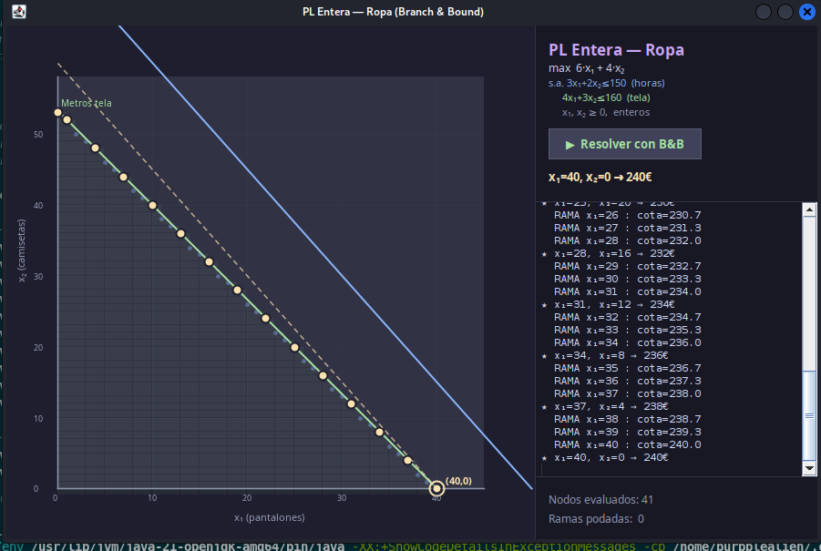
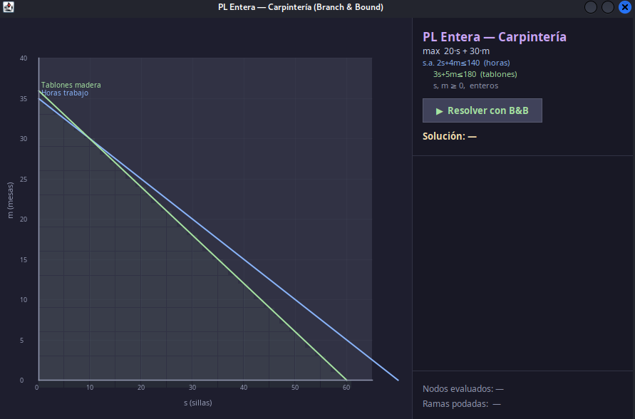
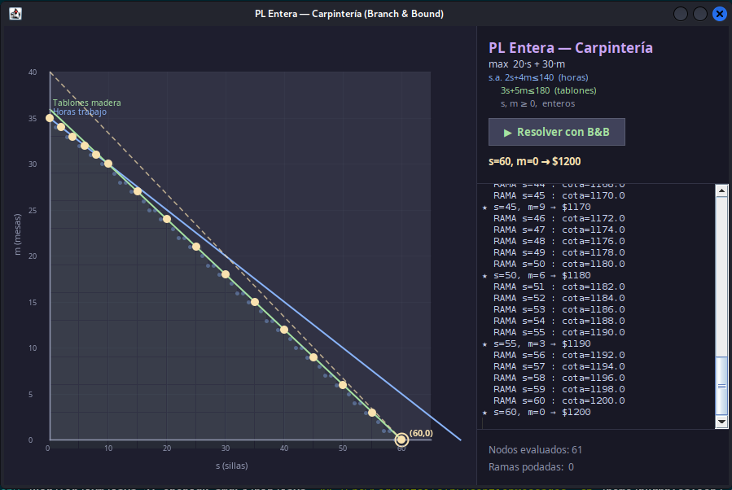

# Programación Lineal con Backtracking

## Descripción

Dos aplicaciones que demuestran el uso de **Backtracking** para resolver problemas de programación lineal y optimización:

1. **BacktrackingPLE** — Solucionador genérico de programación lineal entera.
2. **BacktrackingCarpinteria** — Problema específico de optimización para una carpintería.

## Algoritmo de Backtracking para PL

El backtracking explora el espacio de soluciones enteras satisfaciendo las restricciones lineales:

```
función backtrack(variables, restricciones, objetivo):
    si todasAsignadas(variables):
        si cumpleRestricciones(restricciones):
            actualizarOptimo(objetivo)
        retornar
    para cada valor en dominio(siguienteVariable):
        si esFactible(valor, restricciones):
            asignar(variable, valor)
            backtrack(variables, restricciones, objetivo)
            desasignar(variable)
```

## Problema de la Carpintería

Maximizar ganancias fabricando mesas y sillas con recursos limitados de madera y tiempo de trabajo.

```
Maximizar:  Z = 5x₁ + 4x₂
Sujeto a:   6x₁ + 4x₂ ≤ 24   (madera)
            x₁ + 2x₂  ≤ 6    (tiempo)
            x₁, x₂ ≥ 0, enteros
```

## Capturas de pantalla

### Inicio BacktrackingPLE


### Solución BacktrackingPLE


### Inicio Carpintería


### Solución Carpintería


## Cómo ejecutar

1. Abrir el proyecto en VSCode.
2. Ejecutar `src/BacktrackingPLE.java` para el solucionador genérico.
3. Ejecutar `src/BacktrackingCarpinteriaPLE.java` para el problema de carpintería.
4. Ingresar los coeficientes y restricciones, luego presionar **"Resolver"**.

## Estructura de archivos

```
Programacion_lineal/
├── src/
│   ├── BacktrackingPLE.java              ← solucionador genérico (main)
│   └── BacktrackingCarpinteriaPLE.java   ← problema carpintería (main)
├── bin/
├── Assets/
│   └── img/
│       ├── inicio_aplicacion_BacktrackingPLE.png
│       ├── fin_aplicacion_BacktrackingPLE.png
│       ├── inicio_BacktrackingCarpinteria.png
│       └── fin_BacktrackingCarpinteria.png.png
└── README.md
```

## Tecnologías

- Java 17+
- Swing (GUI)
