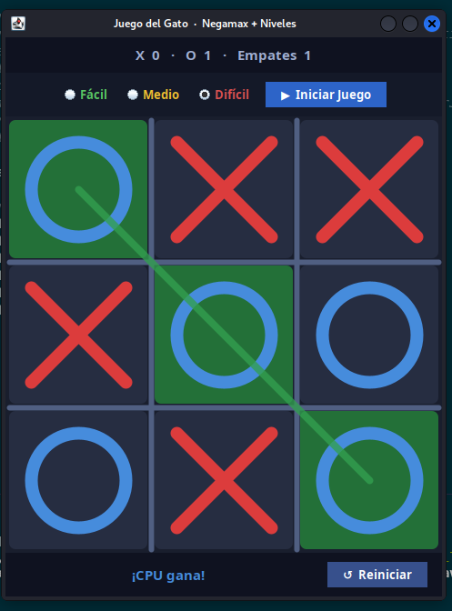
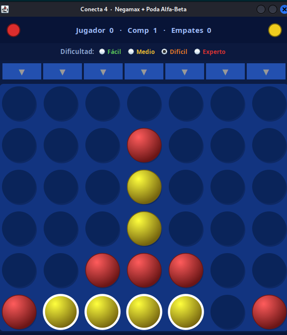
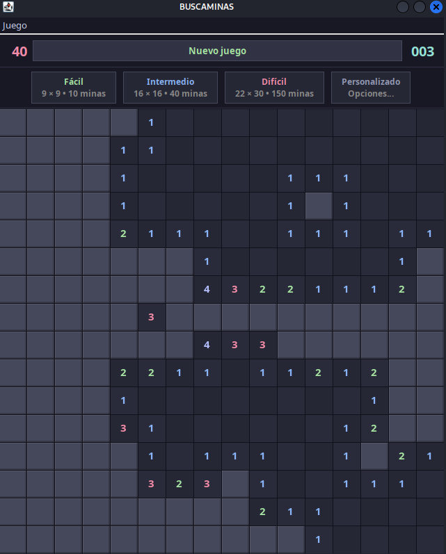
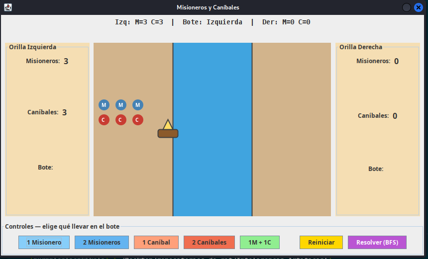
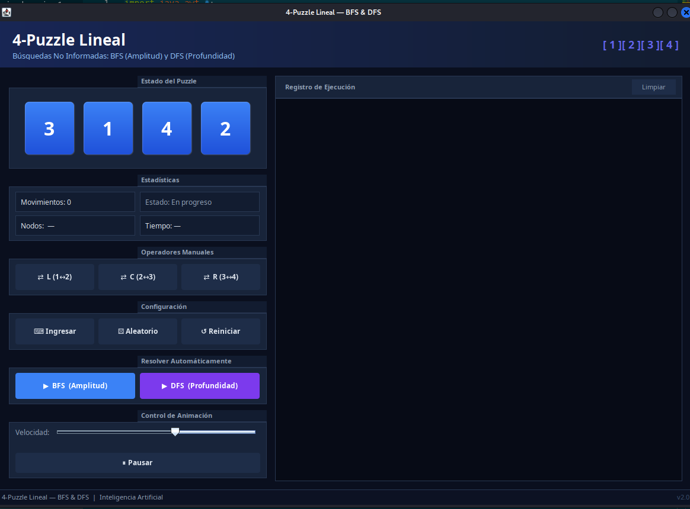
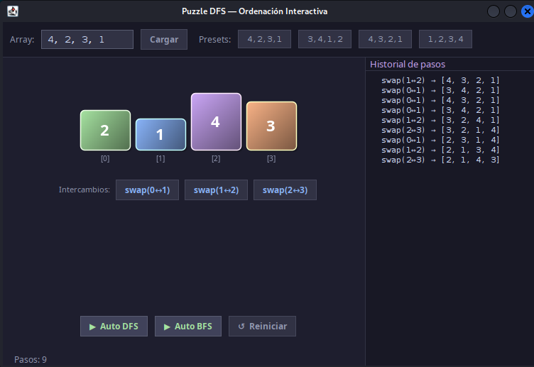
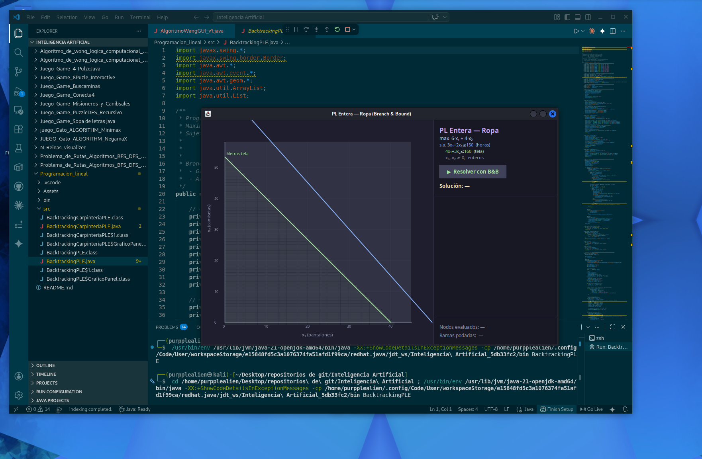

# Inteligencia Artificial — Proyectos Java

Colección de 15 proyectos de **Inteligencia Artificial** implementados en Java con interfaz gráfica (Swing). Cubre algoritmos de búsqueda, juegos con IA, lógica proposicional y optimización.

---

## Proyectos

### Juegos con Inteligencia Artificial

---

#### Gato (Tic-Tac-Toe) con Minimax
IA imbatible usando el algoritmo Minimax clásico.


[Ver proyecto](juego_Gato_ALGORITHM_Minimax/)

---

#### Gato (Tic-Tac-Toe) con Negamax
IA con tres niveles de dificultad usando Negamax.



[Ver proyecto](JUEGO_Gato_ALGORITHM_NegamaX/)

---

#### Conecta 4 con Negamax
Juego de Conecta 4 con IA basada en Negamax.



[Ver proyecto](Juego_Game_Conecta4/)

---

#### Buscaminas con Backtracking
Buscaminas con flood-fill iterativo y múltiples dificultades.



[Ver proyecto](Juego_Game_Buscaminas/)

---

#### Sopa de Letras
Sopa de letras con resolución automática y dark theme.


[Ver proyecto](Juego_Game_Sopa%20de%20letras%20java/)

---

### Algoritmos de Búsqueda

---

#### Misioneros y Caníbales — BFS, DFS, DFS Recursivo
Problema clásico con interfaz gráfica animada y tres algoritmos de búsqueda.



[Ver proyecto](Juego_Game_Misioneros_y_Canibsales/)

---

#### 4-Puzzle con BFS y DFS
Puzzle lineal de 4 fichas resuelto con BFS y DFS, con visualización animada.



[Ver proyecto](Juego_Game_4-PulzeJava/)

---

#### 8-Puzzle Interactivo con Heurísticas
8-Puzzle con distancia Manhattan y piezas mal colocadas.


[Ver proyecto](Juego_Game_8Puzle_Interactive/)

---

#### Puzzle con DFS Recursivo
Visualizador comparativo de DFS recursivo y BFS.



[Ver proyecto](Juego_Game_PuzzleDFS_Recursivo/)

---

#### N-Reinas — Visualizador con Backtracking
Visualización paso a paso del backtracking para el problema de N-Reinas.

 

[Ver proyecto](N-Reinas_visualizer/)

---

#### Problema de Rutas — BFS y UCS (v1)
Planificación de rutas entre ciudades mexicanas con BFS y UCS.


[Ver proyecto](Problema_de_Rutas_Algoritmos_BFS_UCS_A*_vercion_1/)

---

#### Problema de Rutas — BFS, UCS y A* (v2)
Versión extendida con el algoritmo A* y soporte de heurísticas.


[Ver proyecto](Problema_de_Rutas_Algoritmos_BFS_UCS_A*_vercion_2/)

---

### Lógica y Optimización

---

#### Algoritmo de Wang v1 — Demostrador de Teoremas
Implementación del cálculo de secuentes de Wang para lógica proposicional.


[Ver proyecto](Algoritmo_de_wong_logica_computacional_%20vercion_1/)

---

#### Algoritmo de Wang v2 — Demostrador de Teoremas (mejorado)
Versión mejorada con UI enriquecida, selector de ejemplos y salida a colores.


[Ver proyecto](Algoritmo_de_wong_logica_computacional_%20vercion_2/)

---

#### Programación Lineal con Backtracking
Solucionador de programación lineal entera y problema de carpintería.



[Ver proyecto](Programacion_lineal/)

---

## Algoritmos cubiertos

| Categoría | Algoritmos |
|-----------|------------|
| **Búsqueda no informada** | BFS, DFS (pila), DFS Recursivo, UCS |
| **Búsqueda informada** | A*, Heurística Manhattan, Piezas mal colocadas |
| **Juegos adversariales** | Minimax, Negamax |
| **Búsqueda sistemática** | Backtracking |
| **Lógica** | Algoritmo de Wang (cálculo de secuentes) |

---

## Tecnologías

- **Lenguaje:** Java 17+
- **GUI:** Swing (javax.swing)
- **IDE:** VSCode con extensión Java

## Estructura general de proyectos

```
<nombre_proyecto>/
├── src/          ← código fuente (.java)
├── bin/          ← clases compiladas (.class)
├── lib/          ← dependencias (vacío en la mayoría)
├── Assets/
│   └── img/      ← capturas de pantalla
└── README.md
```
