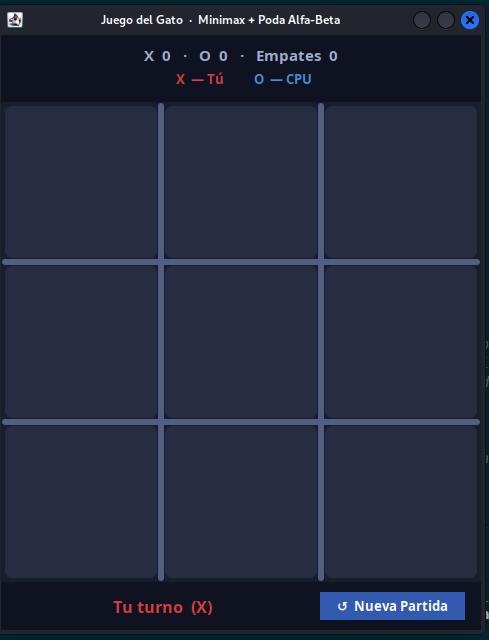
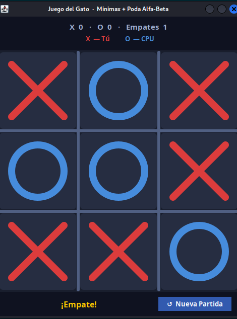
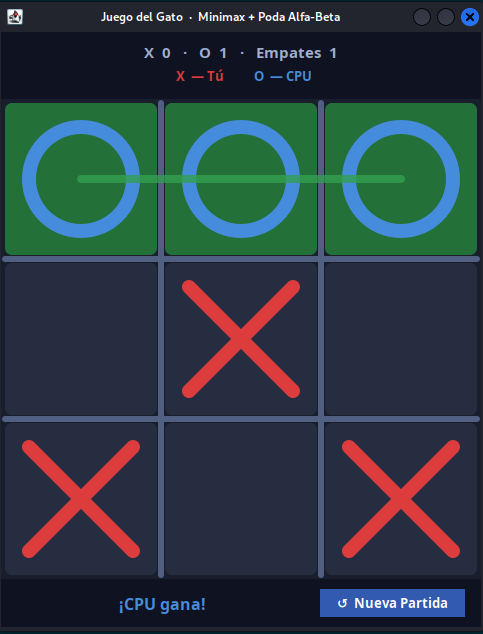

# Gato (Tic-Tac-Toe) con Minimax

## Descripción

Implementación del juego de **Gato (Tres en Raya)** con inteligencia artificial basada en el algoritmo **Minimax**. La IA es imbatible: siempre gana o empata.

## Algoritmo Minimax

**Minimax** es un algoritmo de búsqueda adversarial que construye el árbol completo de juego y elige el movimiento que maximiza la ganancia del jugador máximo (IA) mientras minimiza la del mínimo (humano).

```
función minimax(estado, esMaximizador):
    si estado es terminal:
        retornar puntuación(estado)
    si esMaximizador:
        mejorValor = -∞
        para cada movimiento:
            valor = minimax(aplicar(movimiento), false)
            mejorValor = max(mejorValor, valor)
        retornar mejorValor
    sino:
        mejorValor = +∞
        para cada movimiento:
            valor = minimax(aplicar(movimiento), true)
            mejorValor = min(mejorValor, valor)
        retornar mejorValor
```

## Valores de evaluación

| Resultado | Puntuación |
|-----------|------------|
| IA gana | +10 |
| Humano gana | -10 |
| Empate | 0 |

## Capturas de pantalla

### Inicio del juego


### Empate


### CPU gana


## Cómo ejecutar

1. Abrir el proyecto en VSCode.
2. Ejecutar `src/Gato_SG_GUI.java`.
3. Hacer clic en una celda del tablero para jugar.
4. La IA responde automáticamente con el movimiento óptimo.

## Diferencia con Negamax

| Característica | Minimax | Negamax |
|----------------|---------|---------|
| Código | Dos funciones (max/min) | Una función unificada |
| Rendimiento | Igual | Igual |
| Legibilidad | Más explícito | Más compacto |

## Estructura de archivos

```
juego_Gato_ALGORITHM_Minimax/
├── src/
│   └── Gato_SG_GUI.java   ← lógica completa y GUI (main)
├── bin/
├── Assets/
│   └── img/
│       ├── inicio_gato_minimax.png
│       ├── empate.png
│       └── cpu_gana.png
└── README.md
```

## Tecnologías

- Java 17+
- Swing (GUI)
